# 商品真实化的Roguelike游戏系统设计与开发

## 摘要

近年来，游戏行业和电商行业均处于高速发展阶段，在电商平台中融入游戏元素已经成为一大趋势，而游戏中却很少有电商元素的引入。文章尝试将电商元素融入Roguelike游戏，将真实商品商城融入游戏风格，提升游戏的丰富性和实用性，提高用户粘性。文章使用了虚幻引擎作为游戏开发工具，以Kotlin作为后端主要语言，在采用新技术的同时，探讨了游戏与电商的深度融合，拓展了游戏电商化的理论边界。通过该系统设计，为游戏与电商的深度融合提供了新的思路和实践经验。

## Abstract

In recent years, both the game industry and the e-commerce industry are in the stage of rapid development, and the integration of game elements into e-commerce platforms has become a major trend, while the introduction of e-commerce elements in games is rare.The article tries to integrate e-commerce elements into Roguelike games, integrating real merchandise malls into the game style, enhancing the richness and practicality of the game, and improving user stickiness.The article uses Unreal Engine as the game development tool and Kotlin as the main language of the back-end, which explores the deep integration of games and e-commerce and brings new possibilities for the game industry while tasting new technologies.The experiment provides new ideas and practical experience for the deep integration of games and e-commerce.

## 目录

```
1 绪论
    1.1 研究背景与意义
    1.2 国内外研究现状
    1.3 本文主要创新
    1.4 相关技术
2 游戏设计
    2.1 游戏核心机制
    2.2 经济系统
        2.2.1 货币系统
        2.2.2 资源管理
    2.3 游戏商城设计
    2.4 游戏世界与关卡
    2.5 生物设计
        2.5.1 生物类设计
        2.5.2 角色动画
        2.5.3 玩家输入
        2.5.4 动物和敌人 AI
        2.5.5 攻击伤害实现
    2.6 用户界面
    2.7 音效与视觉表现
3 后端设计
    3.1 数据库设计
        3.1.1 实体与关系
        3.1.2 字段设计
    3.2 安全与认证
        3.2.1 用户密码加密
        3.2.2 资源访问限制
    3.3 商品网络爬虫
    3.4 推荐算法
    3.5 订单
4 总结与展望
    4.1 研究成果总结
    4.2 不足与改进方向
    4.3 未来研究方向
参考文献
致谢
```

## 1 绪论

### 1.1 研究背景与意义

近年来，中国游戏行业蓬勃发展，涌现出许多备受瞩目的作品。其中，《黑神话：悟空》作为一款由国内团队开发的动作角色扮演游戏，凭借其高水准的画面表现、精妙的战斗设计以及对传统文化的创新演绎，成为国产游戏的标杆。该游戏不仅在国内广受关注，在国际游戏市场上也赢得了高度评价，彰显出中国游戏行业在技术、创新和文化输出方面的显著进步。

在电子商务领域，近几年，各大电商平台为增强用户粘性，引入了各种小游戏。这些游戏的类型多以养成、消除、抽奖等为主，游戏难度较低，适合各类用户游玩，极大程度上丰富了平台内容，提升了用户使用时间。除了主要玩法外，游戏的其他内容基本上都是服务于商品营销，例如，有的游戏中会要求用户浏览、购买商品以获取游戏道具。现如今，诸如小红书、抖音等社交、短视频平台接入了电商购物功能，以进一步提升用户留存。然而，在游戏行业却很少有产品结合真实商品售卖，将电商元素融入游戏中。

Roguelike是一种以高难度、随机生成和永久死亡为特点的游戏类型。Roguelike游戏能够为玩家提供极具挑战性和重玩性的体验，让玩家不会因重复性的游戏内容过快厌倦。此类游戏的电商化可以充分利用其难度和随机性，为玩家带来挑战和乐趣，增强平台的用户粘性，提高用户参与度。本文旨在将电商元素融入Roguelike游戏，尝试在游戏中加入真实商品商城，通过将真实商品与游戏机制相结合，使得玩家可以在游戏中使用游戏货币购买所需商品，丰富游戏内容，提升用户粘性。同时，游戏内的推荐算法可以根据玩家的行为和偏好，提供个性化的商品推荐，进一步优化购物体验。通过将电商元素融入Roguelike游戏，本文将为游戏行业开辟新的商业模式，推动游戏与电商的深度融合，为未来游戏开发和电商营销提供新的方向和思路。

### 1.2 国内外研究现状

在国内研究方面，高蕾（2024）和熊瑛（2024）分别从冲动购买和持续意愿的角度指出，游戏化程度与场景匹配度是影响用户行为的关键驱动因素。高蕾的研究表明，游戏化设计能够有效激发用户的冲动购买行为，而场景的匹配度则决定了用户是否愿意持续参与<sup>[1]</sup>。熊瑛则进一步验证了游戏化营销对消费者持续购买意愿的积极影响，强调了使用和满足理论在游戏化设计中的重要性<sup>[2]</sup>。汪旭晖等（2023）通过实证研究，进一步验证了积分、奖励等具体元素对用户参与度和消费意愿的显著提升作用<sup>[7]</sup>，为游戏化设计提供了有力的理论支持。

在游戏化设计层面，李雨欣（2024）强调设计需与平台风格协调，指出游戏化元素的引入应与平台的整体风格保持一致，以避免用户产生割裂感<sup>[6]</sup>。陈元硕等（2024）和张林（2024）则从用户需求满足和元素可感知性的角度提出了优化路径。陈元硕的研究表明，游戏化设计应充分考虑用户需求，通过提升元素的可感知性来增强用户体验<sup>[3]</sup>。张林则进一步探讨了移动电商平台游戏化对消费者行为的影响机理，强调了游戏化设计在提升用户参与度方面的重要作用<sup>[4]</sup>。

李彤云等（2024）和焦媛媛等（2023）的研究补充了游戏化在信息传递与信任构建中的双重价值。李彤云的研究表明，游戏化互动能够有效提升产品信息的传播效果，增强用户对产品的信任感<sup>[8]</sup>。焦媛媛则进一步探讨了电商平台情境下顾客黏性的形成机制，指出游戏化设计在提升顾客黏性方面具有重要作用<sup>[15]</sup>。杜松华等（2022）将视角延伸至社会责任领域，揭示了游戏化对绿色消费的驱动作用<sup>[16]</sup>，强调了游戏化设计在促进可持续发展方面的重要价值。

在用户心理机制方面，马可盈（2022）的系统性模型与何玉川（2024）的忠诚度研究共同表明，感知趣味性、社会影响等心理因素是用户持续使用的重要中介。马可盈的研究构建了游戏化营销情境中电商平台用户持续使用意愿的影响因素模型，指出感知趣味性和社会影响是影响用户持续使用意愿的关键因素<sup>[5]</sup>。何玉川则进一步探讨了游戏化激励对电商平台顾客忠诚度的影响，强调了游戏化设计在提升顾客忠诚度方面的重要作用<sup>[18]</sup>。

此外，李建斌等（2024）、王茜和喻继军（2020）以及楚啸原和杨晓凡（2022）从技术侧探索了个性化推荐与虚拟商品认知如何通过游戏化增强转化效率。李建斌的研究提出了基于商品属性-情境的推荐算法，指出游戏化设计能够有效提升个性化推荐的精准度<sup>[9]</sup>。王茜和喻继军则探讨了基于商品购买关系网络的多样性推荐，强调了游戏化设计在提升推荐效果方面的重要作用<sup>[10]</sup>。楚啸原和杨晓凡的研究则进一步探讨了虚拟商品感知有用性与网络游戏消费意愿之间的关系，指出游戏化设计能够有效提升用户对虚拟商品的认知和消费意愿<sup>[11]</sup>。

在国际研究方面，Paschmann JW等（2025）、Denden M等及Zhang J等（2023）通过实证研究指出，奖励、积分和竞争机制是提升用户参与度的核心手段。Paschmann JW的研究表明，游戏化设计能够有效驱动移动应用的用户参与度，强调了奖励机制在提升用户参与度方面的重要作用<sup>[21]</sup>。Denden M等则进一步探讨了游戏化在区块链系统中的应用，指出游戏化设计能够有效提升用户对区块链系统的参与度<sup>[22]</sup>。Zhang J等的研究则进一步验证了社交游戏化对用户行为的影响，强调了竞争机制在提升用户参与度方面的重要作用<sup>[28]</sup>。

Milanesi M等（2023）和Szachta K（2022）的研究进一步肯定了游戏化对品牌忠诚度的长期价值。Milanesi M的研究表明，游戏化设计能够有效提升数字奢侈品体验，强调了游戏化设计在提升品牌忠诚度方面的重要作用<sup>[26]</sup>。Szachta K则进一步探讨了游戏化在电商市场中的应用，指出游戏化设计能够有效提升用户对品牌的忠诚度<sup>[30]</sup>。

然而，Butler N等（2024）和Durmaz TB等（2024）提出警示，强调游戏化设计需以用户真实幸福感和综合满意度为伦理基准。Butler N的研究指出，游戏化设计应充分考虑用户的真实幸福感，避免过度依赖游戏化元素导致用户产生负面情绪<sup>[23]</sup>。Durmaz TB则进一步探讨了游戏化设计中的可用性测试，强调了游戏化设计在提升用户综合满意度方面的重要作用<sup>[25]</sup>。Ho Y-J等（2022）的非货币化实验则为此提供了对比证据，指出非货币化游戏化设计能够有效提升用户的参与度，强调了游戏化设计在提升用户幸福感方面的重要作用<sup>[31]</sup>。

在策略设计上，Ebrahimi E等（2024）主张通过竞争激发活跃度，指出竞争机制能够有效提升用户的参与度和活跃度。Xu X-Y等（2023）则呼吁群体定制化设计，强调游戏化设计应根据不同用户群体的需求进行定制化设计，以提升用户参与度<sup>[24]</sup>。Kusumawardani KA等（2023）则提出需整合社交与实用价值以优化决策链路，强调了游戏化设计在提升用户决策效率方面的重要作用<sup>[27]</sup>。

国内外学者从多个角度对游戏化在电商平台中的应用及其影响进行了深入探讨，涵盖了用户行为、心理机制、技术实现以及社会价值等多个维度。这些研究不仅为游戏化设计提供了丰富的理论支持，也为未来游戏化在电商平台中的应用提供了重要的实践指导。

### 1.3 主要创新

第一，创新游戏商业模式。传统游戏主要依赖于虚拟商品销售或广告收入，真实商品融入游戏为游戏行业开辟了新的商业模式。这种模式不仅能够为游戏开发者带来额外的收入，还能为商家提供新的营销渠道。

第二，探索Roguelike游戏与真实商品商城的融合。本文尝试结合Roguelike游戏玩法，在游戏中引入符合游戏机制的真实商品商城，通过游戏化的方式促进商品销售，同时使用电商元素丰富游戏内容，推进游戏与电商的融合，为未来跨领域合作提供新的思路。

新技术的应用与实现。本文使用虚幻引擎5开发Roguelike游戏，使用Ktor、Exposed和Kotlin Serialization等构建游戏商城服务器。

### 1.4 相关技术

虚幻引擎5（Unreal Engine 5，简称UE5）是由Epic Games开发的最新版游戏引擎，于2021年5月发布预览。UE5在图形渲染、物理模拟、动画系统、开发工具等方面进行了全面升级，使其成为目前最热门的3D游戏引擎。其核心特性包括Nanite虚拟化集合体、Lumen全局光照、虚拟阴影贴图（Virtual Shadow Maps）、MetaHuman Creator、World Partition、动画系统改进。UE5支持使用蓝图开发游戏，能极大降低上手门槛并提升开发效率。

Ktor是由JetBrains开发的跨平台的轻量级异步Kotlin框架，可用于构建Web应用程序、HTTP服务和微服务。Ktor充分利用了Kotlin语言特性和协程（Coroutines），提供了高性能、可扩展的异步编程模型。其核心特性包括轻量级与模块化、异步与非阻塞、路由系统、丰富的官方内置插件、跨平台支持、易于测试。依赖于逐步健全的Kotlin生态和Kotlin与Java的互操作性，Ktor已然成为一个构建现代化应用程序后端的理想选择。

Exposed是由JetBrains开发的轻量级Kotlin ORM（Object-Relational Mapping，对象关系映射）框架，用于实现Kotlin应用程序与关系数据库的交互。Exposed提供了一种简单的方式来操作数据库，并支持多种数据库类型，如MySQL、PostgreSQL、SQLite等。Exposed的核心特性包括类型安全、可扩展的SQL构建器、事务、批量操作、Lazy Loading、Join操作、自定义SQL语句等。

Kotlin Serialization是由JetBrains开发的Kotlin序列化库，用于序列化和反序列化Kotlin对象。Kotlin Serialization提供了一种简单的方式来将Kotlin对象转换为字节数组，并支持多种序列化格式，如JSON、CBOR、Protobuf等。Kotlin Serialization的核心特性包括可扩展的序列化格式支持、支持自定义序列化器、支持序列化与反序列化配置、支持序列化与反序列化扩展等。

## 2 游戏设计

本系统由游戏（前端）和后端两部分组成。游戏作为本系统中不可分割的主体，遵循了易扩展、可维护的设计理念，在设计上充分利用了继承和多态的面向对象特性，这使得游戏的开发效率和规范性得以提升。游戏的整体设计优化旨在更好地提升玩家的整体体验，使玩家能够体验沉浸式的游戏内容和真实商品商城。

### 2.1 游戏核心机制

Roguelike是以随机生成和永久死亡为特点的游戏类型，起源于1980年的游戏《Rogue》，因其独特的机制和深度的策略性，逐渐发展为一个独立的类别。在本系统的游戏中，玩家需要在一个随机生成的世界中探索，击杀怪物以提升自身能力。玩家的最终目标是找到逃生裂隙，最终安全出逃，获得点数<sup>[31]</sup>。如果玩家在逃生途中不慎死亡，会直接结束游戏，结算本局游戏点数。游玩获得的点数将作为游戏商城中的货币，玩家可以在其中兑换真实商品。

游戏的画面风格参考了《歧路旅人》、《饥荒》等游戏，采用2D+3D的画面表现形式，游戏中的所有生物采用2D精灵图，而游戏场景则使用3D模型。在2D像素画风和3D模型的强烈对比下，可以给玩家带来一种不一样的游戏体验。

游戏开发过程中用到的美术资源均来自虚幻引擎Fab的资源，以及开源社区的素材。

### 2.2 经济系统

#### 2.2.1 货币系统

在本系统中，游戏点数作为游戏货币，可以作为玩家在某局游戏中的分数，也可以作为游戏内的货币，用于购买商品。游戏点数可以通过击杀怪物、收集资源、完成任务等方式获得。考虑到真实货币的购买力在短期内并不会有很大变动，游戏点数与真实货币的转换比例为固定的1000:1。

#### 2.2.2 资源管理

在游玩过程中，玩家需要时刻注意角色的生命值，这是决定玩家能否继续本局游戏的关键。玩家可以通过击败其他生物获得掉落的属性提升卡片增强角色能力、获得状态补给等。此外，游戏中设定了一些较强的首领，击败它们可以获得大量资源，同时玩家也面临着被它们击败的风险，玩家需要权衡角色能力，选择带着已有战利品离开还是继续挑战强敌。这样的设定给游戏带来了一定的变数，玩家需要有一定的决策和应变能力。

### 2.3 游戏商城前端设计

与传统游戏虚拟化道具商城不同，本系统中的游戏商城可以兑换的商品均为真实商品，玩家在控制游戏角色获得游戏点数后，可以直接使用游戏点数来购买真实商品。这样的设计可以强化虚拟与现实的联系，玩家在操控游戏角色进行一系列任务后，可以获得来自现实世界的正面反馈，从而提高玩家的游玩意愿。

在积攒到一定游戏点数后，玩家可以前往游戏商城中购买商品，商品的类型主要是一些日用品、食品和游戏周边，玩家可以根据个人喜好兑换商品。游戏商城的风格与游戏的整体风格一致，不会给玩家太大的割裂感<sup>[6]</sup>。

与电商平台的商城列表有所不同，本系统的游戏列表适配了横屏布局，可以在一行中展示多个商品，并且商品数量可以随屏幕的宽度进行动态调整。商城的货币展示采用了图标和数字的组合，货币图标与游戏结算时获取的游戏点数图标一样采用像素画风，使得游戏商城与游戏内容具有高度一致性，具有较高的辨识度。

商品的图片外层加了像素化的边框，与货币的效果类似，通过这些具备游戏风味的元素，可以呈现出与游戏画风一致的视觉效果。商城的背景使用了像素画和黑色透明蒙版，增加页面丰富度的同时不会带来视觉干扰。

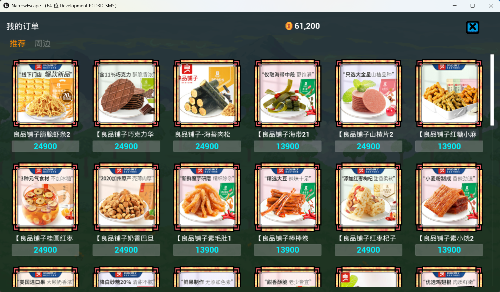

玩家在兑换商品后，会扣除玩家的游戏点数，并展示兑换成功的提示。打开“我的订单”页面，玩家可以看到自己历史兑换商品的列表。订单页面与商品列表的风格保持一致，以确保游戏UI的一致性，减少割裂感。

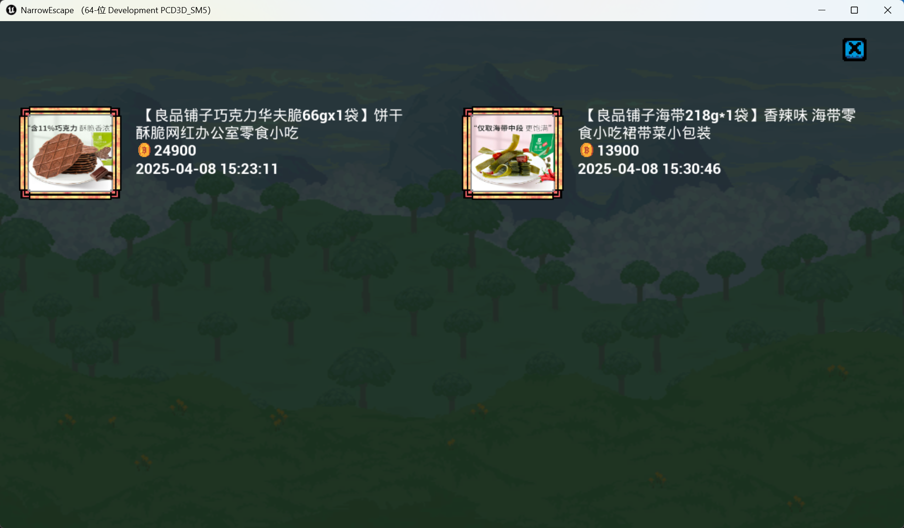

### 2.4 游戏场景生成

游戏的基础地形是由400*400的平面方格组成，地图的四周使用巨石围绕，玩家在游玩时只能看到旁边的巨石。


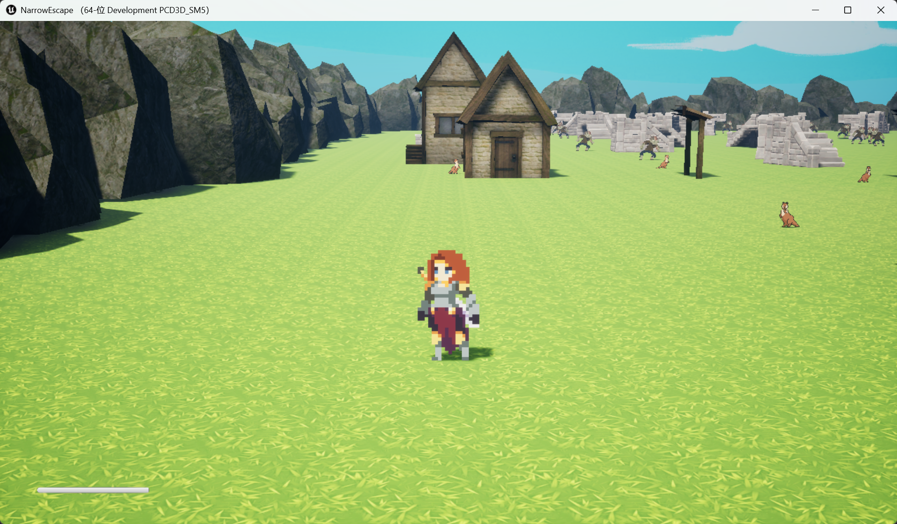

游戏的建筑、植物和生物部分使用了PCG（Procedural Content Generation）技术生成。PCG是虚幻5中新增的程序化内容生成框架，该框架通过自动化和程序化的方式生成游戏世界中的各种元素，如植被、建筑物、生物等，旨在帮助开发者高效地创建复杂且多样化的游戏内容。

虚幻5的PCG框架目前还处于实验性（Beta）阶段，在开发时需要在项目插件设置中打开PCG Framework和PCG Framework Geometry Script Interop插件。


PCG图的生成需要经历获取地形数据、使用表面采样器对地形数据进行采样、对采样后的数据进行一系列的调整、修改和差异化等步骤，最终在指定区域内生成静态网格体、Actor等元素。

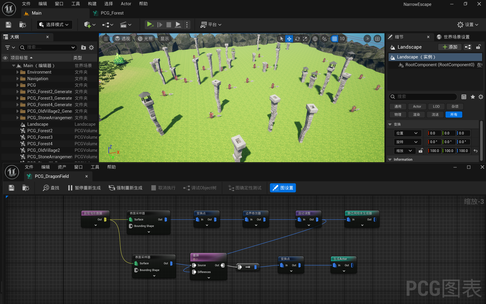

PCG生成的地图具备较强的随机性，可以快速生成多种风格的地形。本游戏利用此框架设计了森林、城镇、废墟、石阵等不同风格的地貌，并在其中生成了与之相匹配的生物，增强游戏的可玩性。此外，因为PCG在生成时可以根据提供的随机种子生成不同的场景结构，玩家每次开始新游戏后都能游玩到与之前不同的游戏场景，满足玩家对地图多样性的需求。

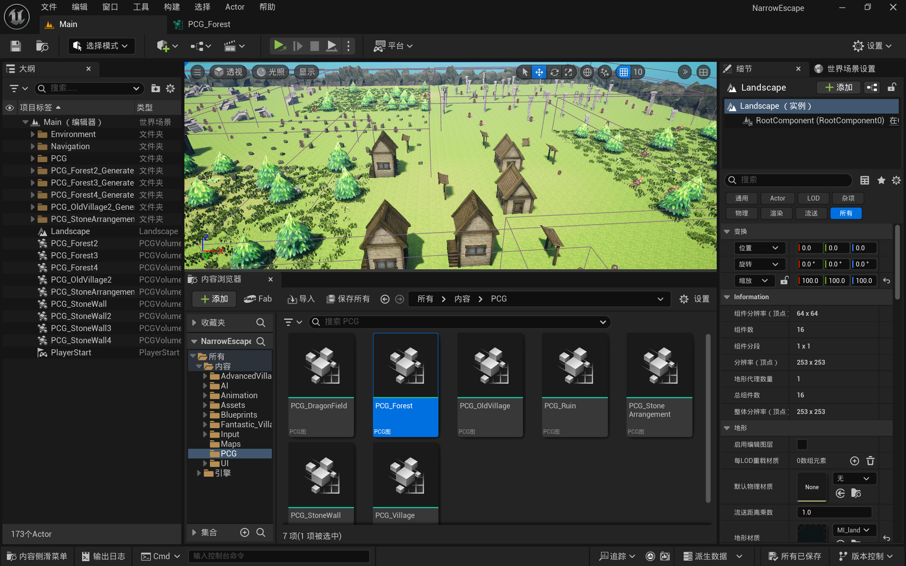

### 2.5 易扩展的生物设计

#### 2.5.1 生物类设计

为了方便后续开发维护，本游戏设计了一套易于扩展的游戏生物系统。在后续添加新的生物时，可以快速集成已有功能。这样既降低了开发成本，也减少了玩家因为对旧生物群落产生厌倦而放弃游玩的情况。

游戏中的生物都统一由一个蓝图类BP_Creature（生物，派生自PaperZDCharacter）派生而来，在BP_Creature下派生出BP_Animal（动物）和BP_Hunter（狩猎者，可对其他生物发起攻击），BP_Hunter下派生出BP_Character（玩家）和BP_Enemy（敌人）。在之后如果需要添加新的生物，只需要由BP_Animal、BP_Character和BP_Enemy派生即可。

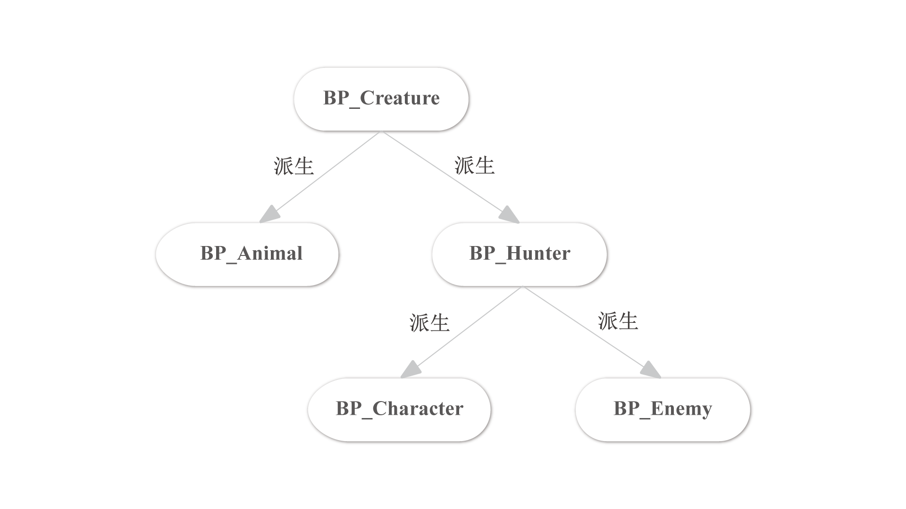

游戏中的生物都是2D精灵，在将2D纹理导入虚幻引擎后，需要使用Pager2D对纹理应用处理，提取出精灵图并组成对应动画的纸片图像序列，之后使用PaperZD插件创建精灵的动画源和动画蓝图。

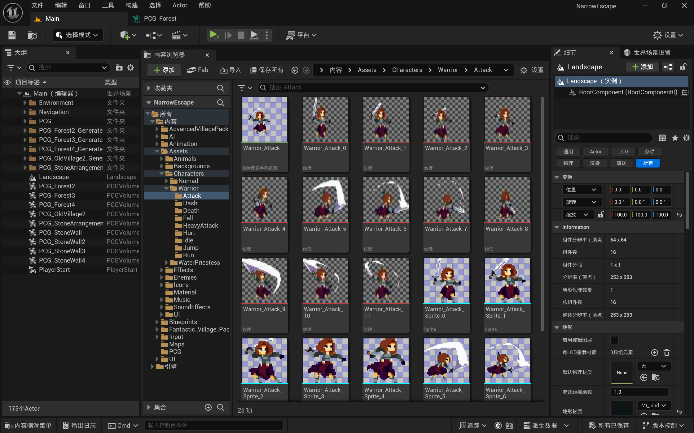

2D生物需要将精灵材质改为MaskedLitSpriteMaterial，并设置投射阴影以展现光照阴影效果。


因为所有生物均为2D精灵图，其Z轴旋转只能有两个值：0或180。生物移动时，需要根据X轴方向决定生物的Z轴相对旋转。具体来说，当X轴方向为正时，Z轴应相对旋转应为0，当X轴方向为负时，Z轴应相对旋转应为180。

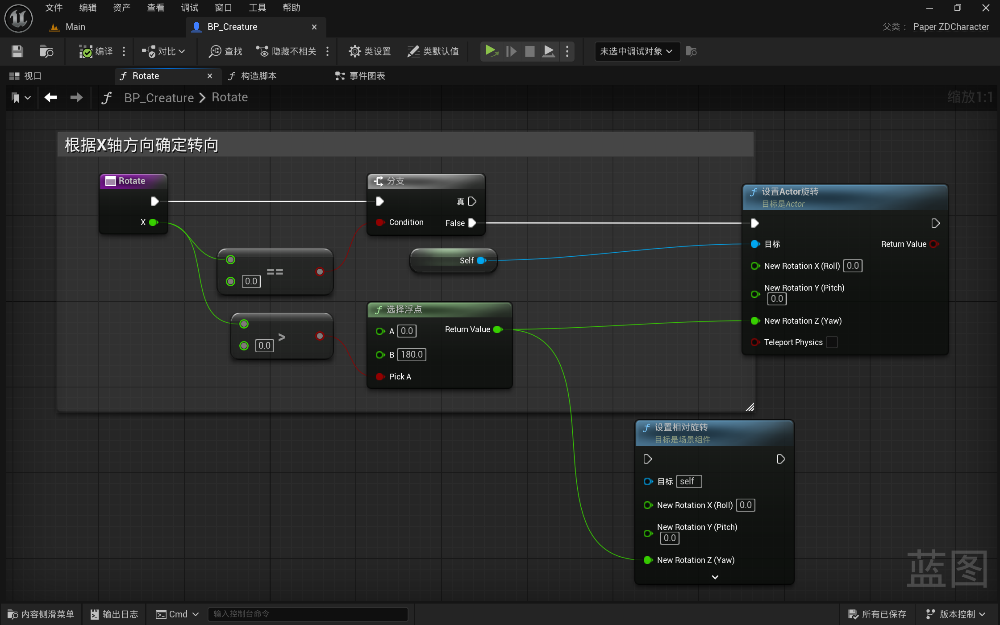

#### 2.5.2 角色动画

在虚幻5中，2D角色的动画需要通过一系列的动作纹理图组合成纸片图像序列来实现，而多个动画的切换需要借助动画状态机来实现。虚幻5本身并没有对2D角色动画状态机的支持，因此需要使用PaperZD插件创建2D角色的动画源和动画蓝图。

在本游戏中，角色的动画源中定义了轻攻（Attack）、冲刺（Dash）、死亡（Death）、下落（Fall）、重击（HeavyAttack）、受伤（Hurt）、待机（Idle）、跳跃（Jump）和跑步（Run）动画。


动画蓝图中可以创建动画状态机，根据角色当前状态来播放动画。不同状态间的切换通过角色蓝图中的布尔（Bool）变量值来判断。

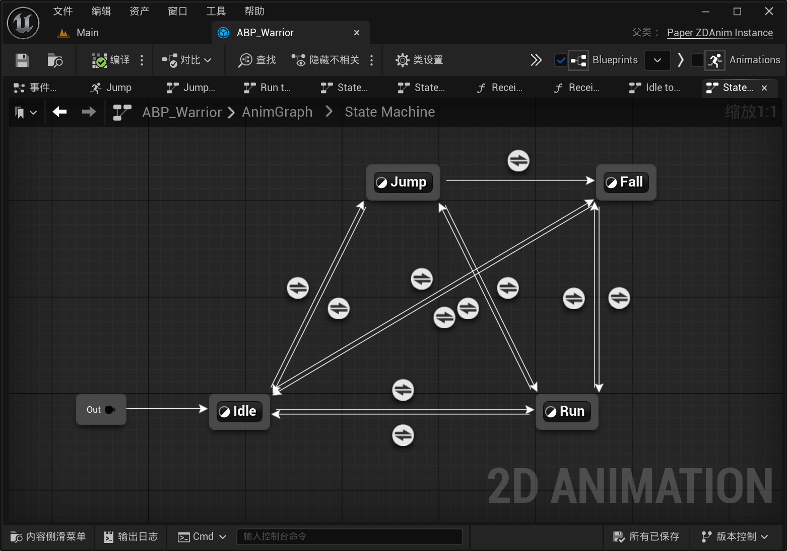

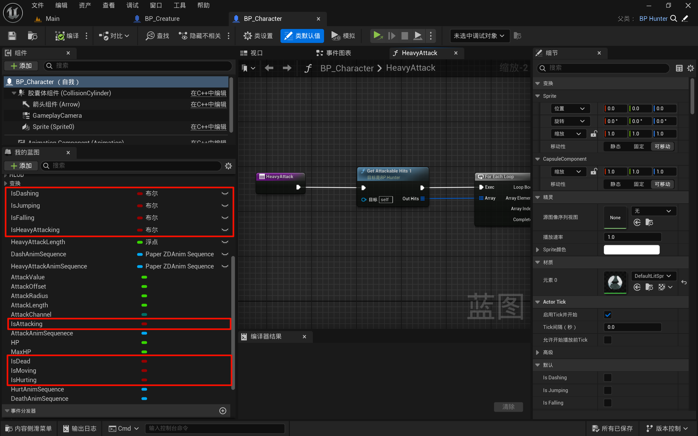

#### 2.5.3 玩家输入

虚幻5的增强输入系统（Enhanced Input System）是对传统输入系统的升级，旨在提供更灵活、强大的玩家输入处理能力。该系统支持复杂的输入处理、运行时重新映射输入、以及多平台输入设备的无缝继承。

本文创建了攻击（IA_Attack）、冲刺（IA_Dash）、跳跃（IA_Jump）和移动（IA_Move）的输入操作，并通过输入映射上下文将键盘、鼠标等的输入操作映射到输入操作。

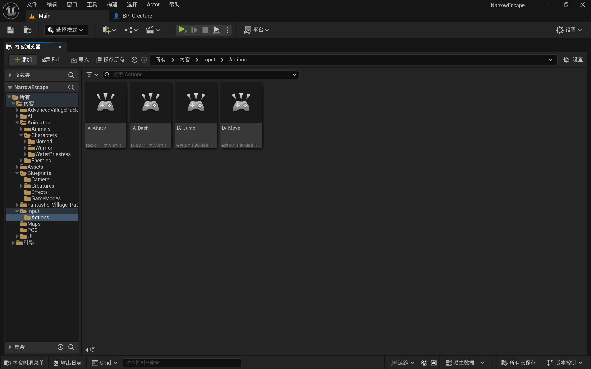


之后需要将映射上下文添加到玩家控制器增强输入本地玩家子系统上，并实现相应的输入操作事件，即可实现玩家输入操作。

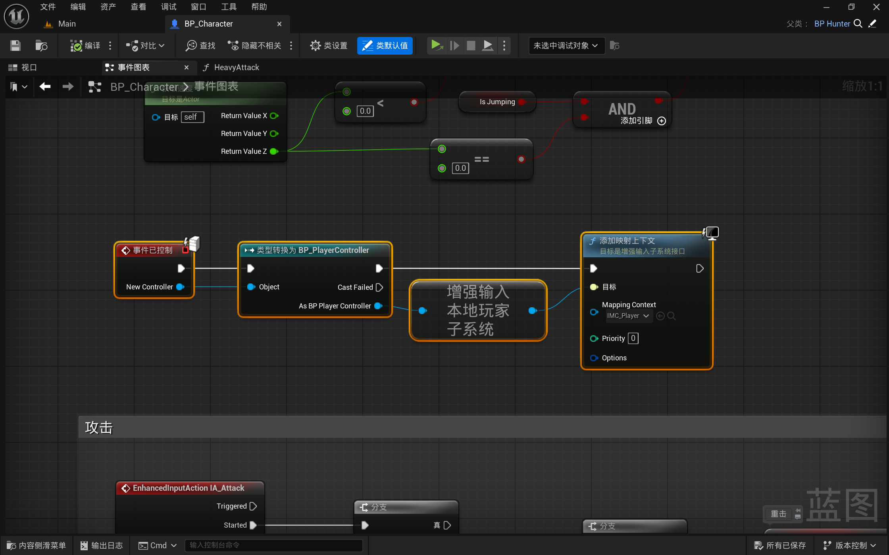

当玩家按下鼠标左键触发攻击操作时，若角色不在死亡、受伤、轻击或重击状态，则会根据角色当前是否在冲刺、跳跃或下落，决定执行轻击或重击操作。

当玩家按下键盘左Shift键触发冲刺操作时，若角色不在死亡、受伤、重击或冲刺状态，则会弹射角色进行冲刺操作。

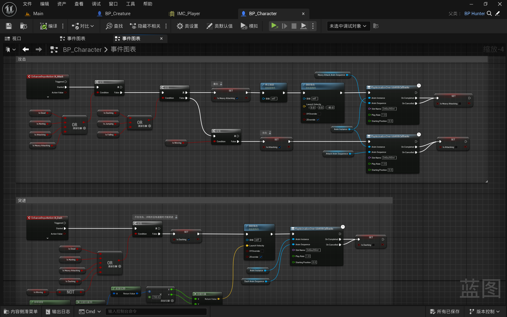

当玩家按下空格键触发跳跃操作时，若角色不在死亡、受伤、重击或跳跃状态，则会移除轻攻，进行跳跃操作。

当玩家按下W、A、S和D键触发移动操作时，若角色不在死亡、受伤或重击状态，则会移除轻攻，并进行移动操作，同时旋转角色。

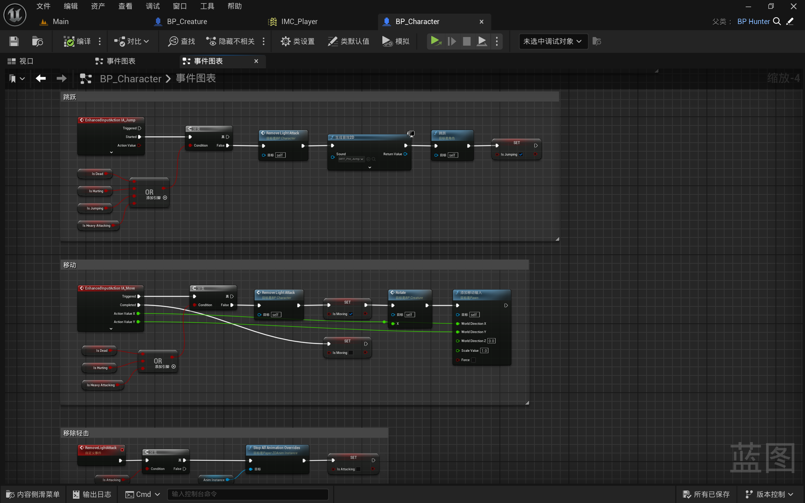

#### 2.5.4 动物和敌人 AI

虚幻5中的AI行为树（Behavior Tree）是一种用于实现游戏AI的强大工具。它通过树状结构来定义AI的行为逻辑，使得开发者能够以模块化和可视化的方式构建复杂的AI行为逻辑。

在本文中，动物和敌人都具备一个行为：当处于闲置状态时，每隔一段时间在出生地附近走动。

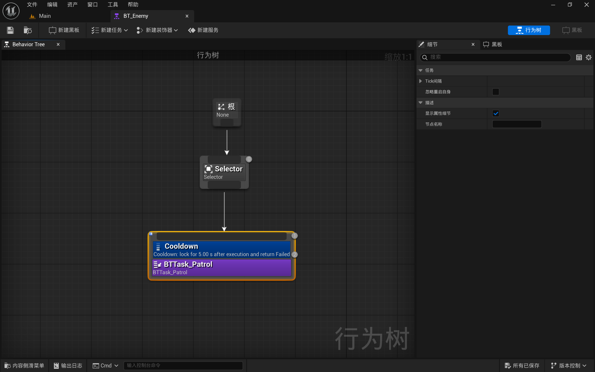

此外，动物和敌人的蓝图都添加了一个PawnSensing组件，该组件会触发OnSeePawn事件。当玩家靠近时，动物会朝着远离玩家的方向跑；而敌人会朝着玩家的方向跑，并在可以攻击时攻击玩家。

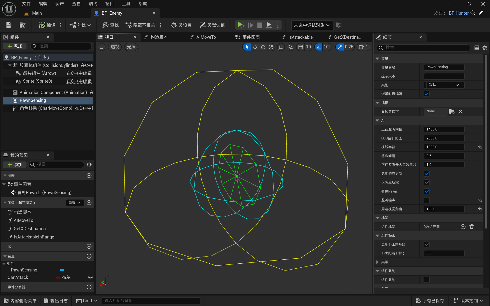

#### 2.5.5 攻击伤害实现

虚幻5的蓝图中提供了应用伤害和任意伤害事件。在播放攻击动画时，可以向角色前方执行按通道进行多球体碰撞，检测到可攻击对象时，调用应用伤害对可攻击对象造成伤害。对于被攻击方，则实现任意伤害事件，减少生命值并播放受伤动画。

在本文中，应用伤害的功能被定义于BP_Hunter中，只有狩猎者才能发出攻击；而任意伤害事件被定义于BP_Creature中，所有生物均可被攻击。

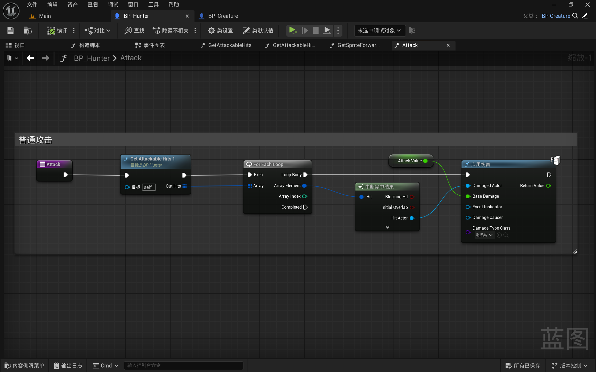

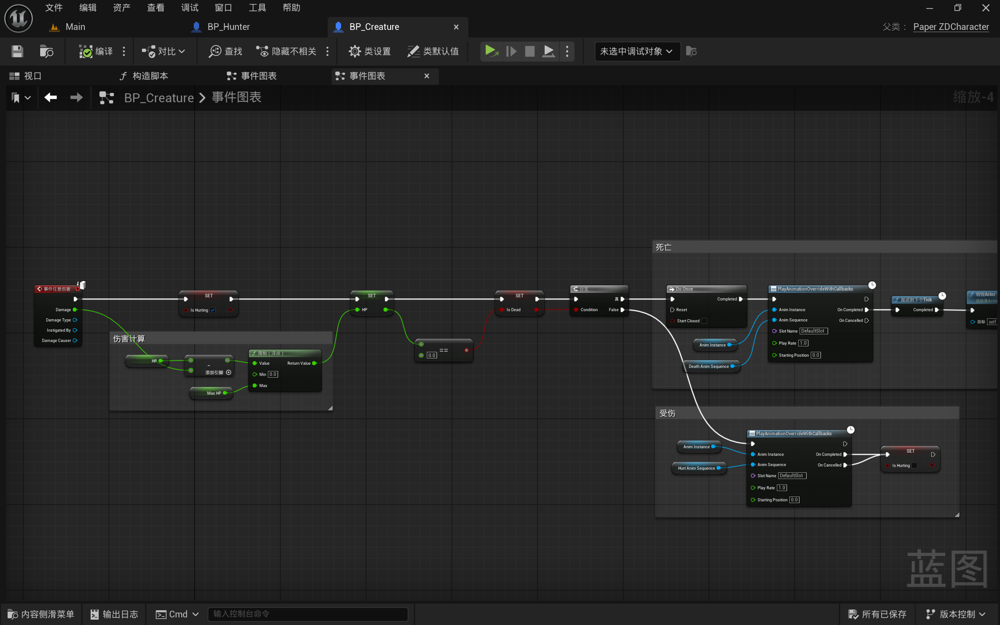

### 2.6 用户界面

虚幻5提供了强大的工具和框架来创建用户界面（User Interface，简称UI）。UMG是虚幻5中用于创建用户界面的主要工具，基于Slate框架构建，提供了可视化的UI设计器。其主要组件包括Widget Blueprint和Widget Components，可以用来组合复杂的用户界面。

在设计UI时，应当将其拆分为多个小部件（Widget），便于复用和维护。例如，图2.5.6-1中的多个按钮来自同一个组件蓝图类，减少重复操作的同时能做到最大化复用逻辑。要尽量避免在每帧中更新不必要的UI元素，使用缓存和延迟更新技术。确保UI交互逻辑直观易用，提供清晰的提示和反馈。

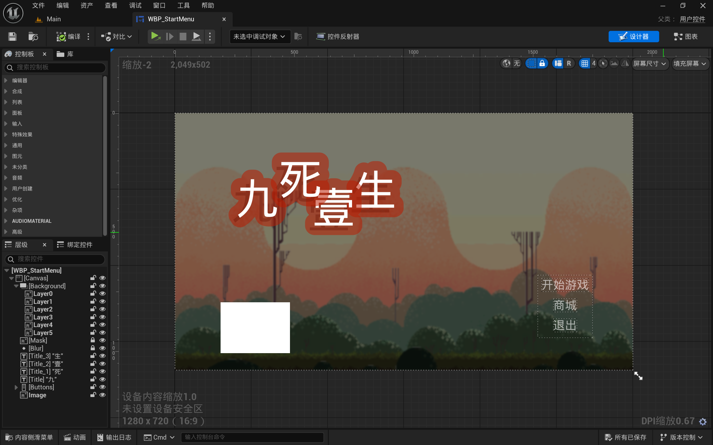

### 2.7 音效与视觉表现

虚幻5支持在多种情景下播放音乐或音效，例如在UI创建时，可以调用PlaySound2D来播放背景音乐；鼠标悬停按钮时，可以触发相关事件并播放音效；角色播放动画时，可以定义播放音效的通知实现在动画时播放音效。通过为多种情景添加适当的音乐或音效，可以提升用户的使用体验<sup>[4]</sup>。


本文参考了《歧路旅人》的游戏表现风格，采用2D+3D的形式呈现角色和游戏场景，同时使用多个2D特效补充角色动画过程中的单调表现，提升游玩乐趣。

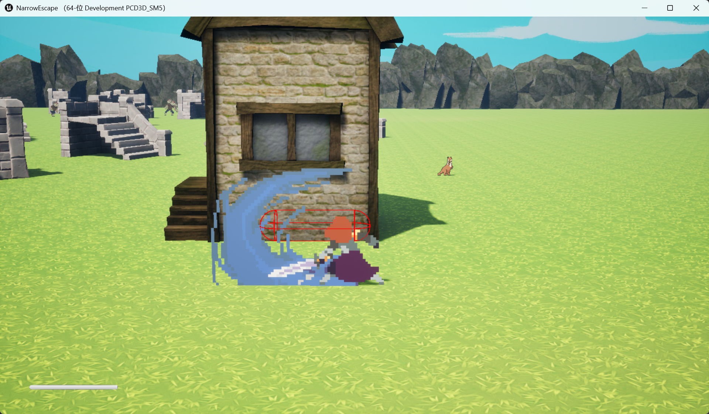

## 3 后端设计

本文的后端全都使用Kotlin的框架。

在服务器构建上使用异步框架Ktor。Ktor充分利用了Kotlin的语言特性，避免了传统回调地狱（Callback Hell）问题，代码更简洁易读。此外，因为Kotlin是一门强类型语言，并且对null检测进行了优化，可以避免很多常见的错误。同时，Kotlin的跨平台特性也使得Ktor成为一个跨平台框架，易于移植和维护。Ktor基于异步非阻塞的I/O模型，能够高效处理高并发请求，减少线程开销。

在数据库连接上，使用了Exposed。Exposed是一个Kotlin的ORM框架，使用DSL（Domain Specific Language）风格，开发者不需要自己编写SQL语句，使得数据库操作更加简单易读。

### 3.1 数据库设计

本文使用MySQL作为后端数据库。MySQL是一个关系型数据库管理系统，以其高性能、可靠性和易用性而闻名。MySQL支持多种操作系统，包括Windows、Linux、macOS等。

#### 3.1.1 实体与关系

本文的数据库设计包含三个实体：用户、商品和订单。三者之间存在以下关系：
- 用户与商品：一个用户可以购买多个商品，一个商品可以属于多个用户。
- 用户与订单：一个用户可以拥有多个订单，一个订单属于一个用户。
- 商品与订单：一个商品可以属于多个订单，一个订单包含多个商品。

#### 3.1.2 字段设计

##### （1）用户

主键：id

属性：name（玩家名称）、password（密码）、points（游戏点数）

##### （2）商品

主键：id

属性：name（商品名称）、image（图片）、points（所需游戏点数）

##### （3）订单

主键：id

属性：userId（用户id）、productId（商品id）、time（下单时间）

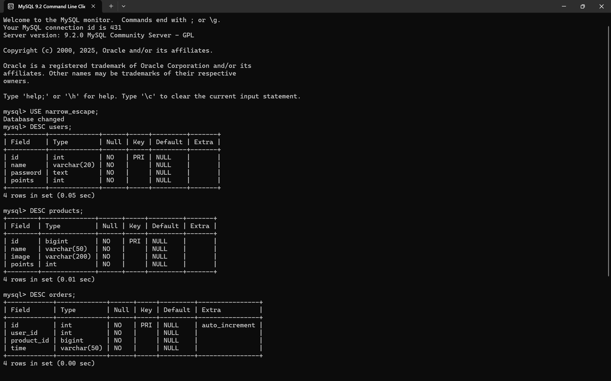

### 3.2 安全与认证

#### 3.2.1 用户密码加密

通常，用户的密码在存储到数据库时不能以明文形式存储，必须进行哈希加密（不可逆加密）。Argon2是一种密码哈希函数，专为密码哈希和密钥派生而设计。它在2015年赢得了密码哈希竞赛（Password Hashing Competition），并被广泛认为是目前最安全的密码哈希算法之一。

本文中借助了Argon2进行密码加密，在密码存入数据库前，先对密码进行加密处理。在登录时，只需要验证加密后的密码是否与数据库中存储的加密后密码匹配，以确定用户身份。

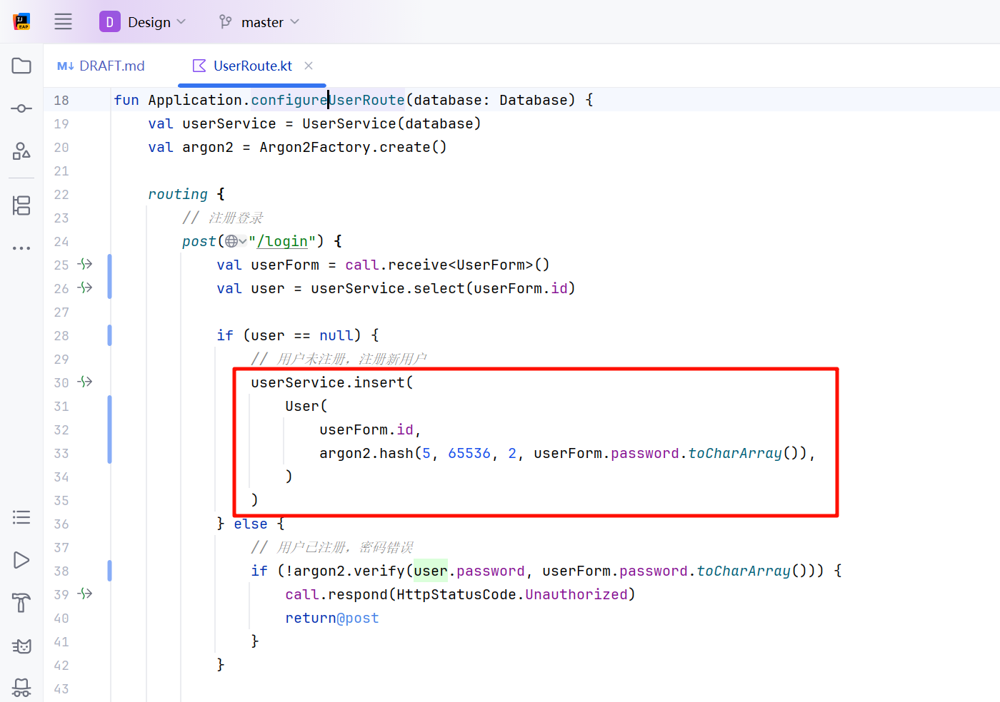

#### 3.2.2 资源访问限制

JWT（JSON Web Token）是一种开放标准（RFC 7519），用于在网络应用间安全地传输信息。它通常用于身份验证和信息交换，特别是在分布式系统中。JWT由Header、Payload和Signature三部分组成，三者用“.”分隔。Header部分包含令牌的类型和使用的签名算法，Payload部分包含关于实体和其他数据的声明（claims），Signature部分包含将Header和Payload进行Base64Url编码和算法计算的签名，用于验证令牌的完整性和真实性。

本文使用了Ktor的JWT认证插件，在Ktor后端中实现JWT认证功能。后端的商品列表、订单等资源访问需要在请求头中添加Authorization字段，值为Bearer <Token>。

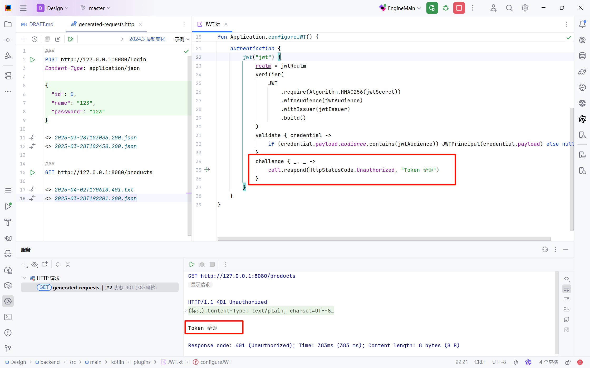

### 3.3 商品网络爬虫

因展示需要，本文后端使用Ktor客户端向当当网发起网络请求，获取商品列表。得到的请求结果为HTML格式，本文使用了Ksoup（基于Jsoup）将请求结果HTML解析，获取商品信息并存储到商品数据类，最后统一存储到数据库中。

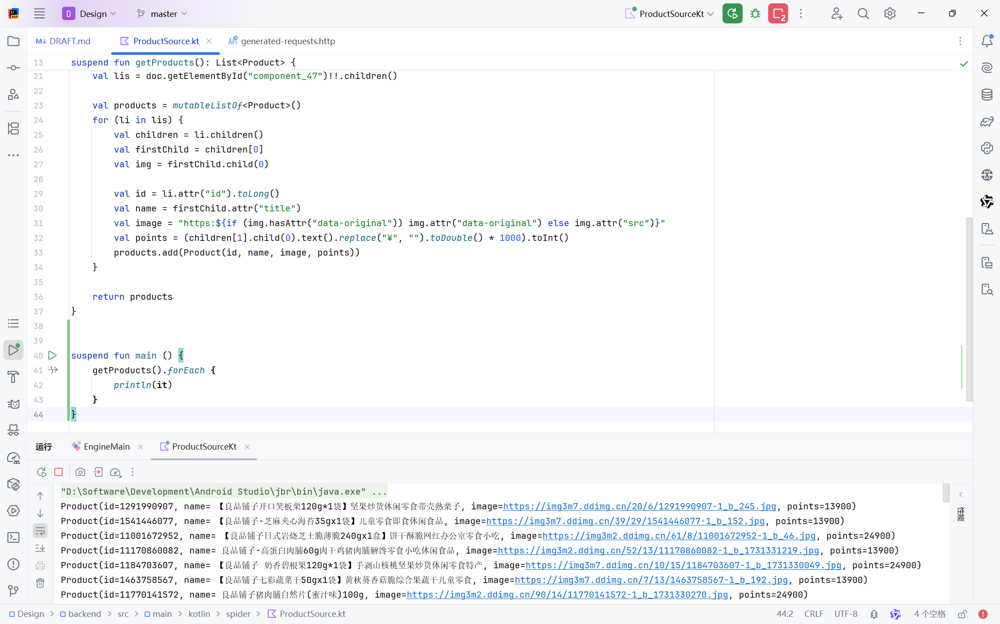

商品列表的爬取和存储采用懒加载的方式，仅当后端商品列表API被调用时，才会确定商品数据库是否为空，若为空则发起网络请求获取并解析商品列表，最后存储到数据库并返回给前端。

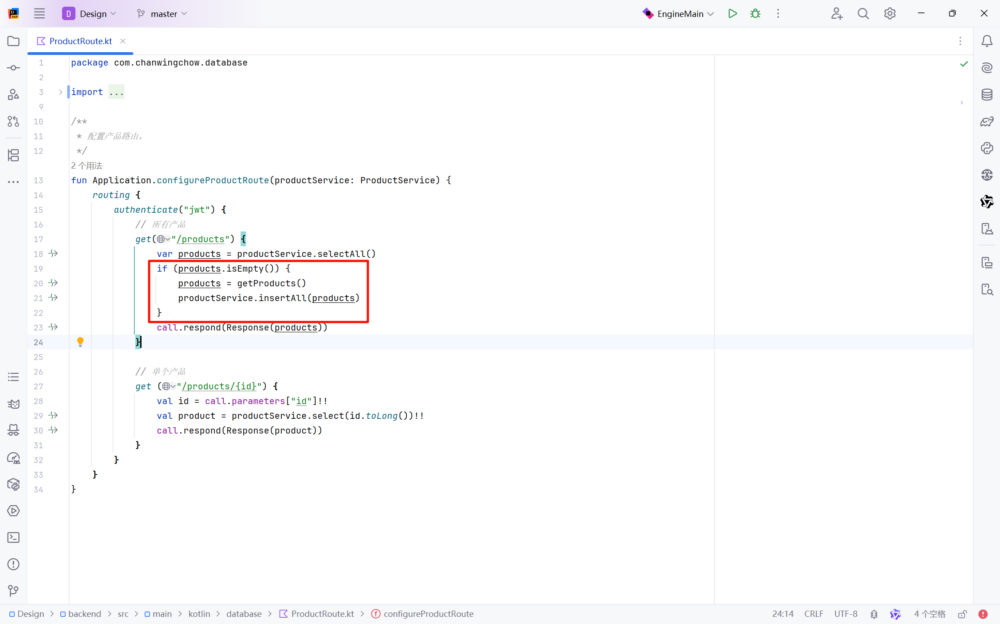

### 3.4 推荐算法

本文中设计了一个比较简单的推荐算法：基于玩家历史购买记录<sup>[10]</sup>过滤出符合玩家喜好的商品，之后确定商品的所需点数超过玩家当前游戏点数<sup>[9]</sup>的比例，决定是否进行按游戏点数升序排序。最后结合一些随机推荐的内容，将两者按照一定权重进行混合，最终返回。

Sublime Text 的模糊搜索算法（Fuzzy Searching Algorithm）是一种强大的文本搜索技术，允许用户在不完全匹配的情况下快速找到目标内容，该算法是业界公认的最佳算法之一。本文使用该算法对商品名称进行匹配，以找到与玩家历史购买记录最相似的商品。

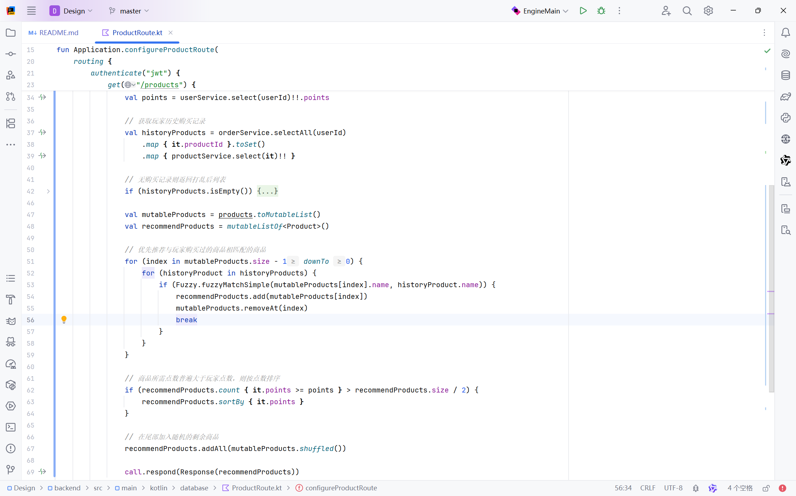

### 3.5 订单

因订单系统的设计需要接入第三方支付平台，本文简化了订单功能。

玩家在发起订单时，会向服务器提供商品id，后端根据id在数据库中查找商品，并判断玩家点数是否大于商品所需点数，若满足条件，则创建订单，向订单数据库中插入一条记录，并扣除玩家点数；否则订单创建失败。

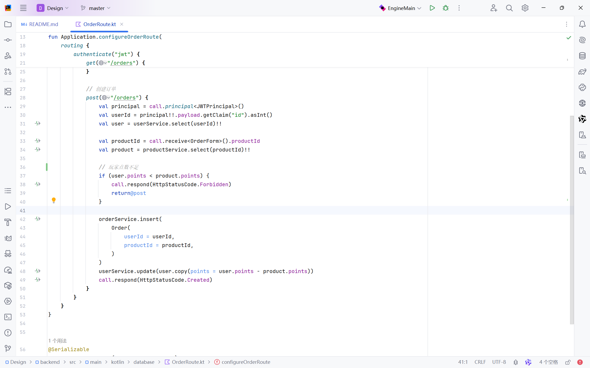

## 4 总结与展望

### 4.1 研究成果总结

本文使用虚幻5和Ktor分别开发了游戏前后端，对Roguelike游戏电商化做出了简单实现，提供了具有良好扩展性和可维护性的系统设计。本文主要的工作和贡献如下：

第一，对当前游戏电商化进行了总结分析，并指出Roguelike游戏在游戏电商化中的应用前景。

第二，本文在服务器安全性方面使用了Argon2和JWT技术，实现了用户密码加密和资源访问限制。

第三，本文采用的商品推荐算法是基于玩家历史购买记录进行过滤，根据玩家点数和商品的所需点数进行排序，最后结合一些随机的内容进行混合

第四，本文使用虚幻5开发了2D+3D的Roguelike游戏，实现了程序化内容生成（PCG）框架，自动生成多样化的游戏场景和生物。同时，采用Ktor、Exposed和Kotlin Serialization等技术构建了高效、可扩展的游戏商城服务器。在保持游戏与商城高度统一的同时，也确保系统的可利用、可维护。

### 4.2 不足与改进方向

第一，本文只实现了使用游戏货币全量购买商品，没有实现部分商品采用游戏货币部分抵扣加真实货币购买的功能。这会导致游戏对于商家而言只有支出而没有收入，需要做进一步优化。同时，还可以考虑通过引入广告的方式增加收入。

第二，游戏的可玩性和丰富度尚存在不足。游戏存在生物群落比较单一、游戏道具不够丰富等问题。游戏的战斗系统存在缺陷，玩家攻击时并不能主动走向被攻击生物，角色的攻击方式也过于单一。游戏的商城功能并不完善，例如购物车功能、订单系统的缺失。这些需要后续逐步优化和迭代。

## 参考文献

[1] 高蕾.电商平台游戏化对用户冲动购买行为的影响机制研究[D].东华大学,2024.

[2] 熊瑛.电商平台游戏化营销对消费者持续购买意愿的影响研究——基于使用和满足理论的视角[J].商业经济研究,2024,(20):71-74.

[3] 陈元硕,谢薇.电商平台游戏中的绿色广告行为及其规制研究[J].科技传播,2024,16(11):120-123.

[4] 张林.移动电商平台游戏化对消费者行为的影响机理研究[D].哈尔滨工业大学,2024.

[5] 何玉川.游戏化激励对电商平台顾客忠诚度影响研究[D].山西财经大学,2024.

[6] 李雨欣.游戏化互动对电商平台用户参与意愿的影响研究[D].广东财经大学,2024.

[7] 汪旭晖,刘熙桐,宋松.平台型电商游戏化营销策略对用户消费行为的影响[J].中国流通经济,2023,37(04):47-59.

[8] 李彤云,马军平,杨昊博,曹丽.产品信息的游戏化传播及说服效应研究[J].内江科技,2022,43(01):82-83+148.

[9] 李建斌,钱自顺,蔡学媛,戴宾.跨境电商下基于商品属性–情境的推荐算法[J].系统工程学报,2024,39(03):333-343+468.

[10] 王茜,喻继军.基于商品购买关系网络的多样性推荐[J].系统管理学报,2020,29(01):61-72.

[11] 楚啸原,杨晓凡,理原,雷雳.虚拟商品感知有用性与网络游戏消费意愿：有调节的中介模型[J].中国临床心理学杂志,2020,28(05):1013-1016.

[12] 李宣.移动营销中的游戏化及其规制研究——基于行为经济学的视角[J].四川师范大学学报(社会科学版),2023,50(06):98-107.

[13] 王治,江文婷.游戏化营销策略对消费者补偿性消费行为的影响[J].商业经济研究,2024,(14):47-51.

[14] 余文涛,张国阳,何毅,耿慧.平台经济环境下“平台-物流-商家”生态合作演化博弈研究[J].系统工程理论与实践,1-30.

[15] 焦媛媛,高雪,张丹.电商平台情境下顾客黏性构念开发及其形成机制研究[J].管理工程学报,2023,37(04):67-84.

[16] 杜松华,徐嘉泓,张德鹏,杨晓光.游戏化如何驱动电商用户绿色消费行为——基于蚂蚁森林的网络民族志研究[J].南开管理评论,2022,25(02):191-204.

[17] 张剑,罗君.“游戏化”视角下电商平台“拉人助力”玩法分析——以“超级星秀猫”为例[J].文化与传播,2021,10(04):87-91.

[18] 马可盈.游戏化营销情境中电商平台用户持续使用意愿影响因素研究[D].华南理工大学,2022.

[19] 文露.手机电商时代APP游戏化特征对消费者持续使用意愿的影响研究[J].中国储运,2022,(02):86-87.

[20] 唐乐水,马缘园.心流理论下电商直播间的游戏化叙事[J].南京晓庄学院学报,2022,38(03):104-109.

[21] Paschmann JW, Bruno HA, van Heerde HJ, Völckner F, Klein K. Driving Mobile App User Engagement Through Gamification[J]. Journal of Marketing Research (JMR). 2025, 62(2):249-273.

[22] Denden M, Abed M, Holotescu V, Tlili A, Holotescu C, Grosseck G. Down to the Rabbit Hole: How Gamification is Integrated in Blockchain Systems? A Systematic Literature Review[J]. International Journal of Human-Computer Interaction. 2024, 40(19): 5617-5631.

[23] Butler N, Spoelstra S. Redemption Through Play? Exploring the Ethics of Workplace Gamification[J]. Journal of Business Ethics. 2024, 193(2): 259-270.

[24] Ebrahimi E, Irani HR, Abbasi M, Abedini A. The effect of gamification on brand equity and desirable consumer behaviors in online retail stores: The mediating role of brand engagement[J]. Interdisciplinary Journal of Management Studies. 2024, 17(2): 379-391.

[25] Durmaz TB, Fuertes JL, Imbert R. Toward Usability Testing of Motivational Affordances through Gamification[J]. International Journal of Human-Computer Interaction. 2024, 40(9): 2398-2414.

[26] Milanesi M, Guercini S, Runfola A. Let's play! Gamification as a marketing tool to deliver a digital luxury experience[J]. Electronic Commerce Research, 2023, 23(4): 2135-2152.

[27] Kusumawardani KA, Widyanto HA, Tambunan JEG. The role of gamification, social, hedonic and utilitarian values on e-commerce adoption[J]. Spanish Journal of Marketing - ESIC, 2023, 27(2): 158-177.

[28] Zhang J, Jiang Q, Zhang W, Kang L, Lowry PB, Zhang X. Explaining the Outcomes of Social Gamification: A Longitudinal Field Experiment. Journal of Management Information Systems[J]. 2023, 40(2): 401-439.

[29] Xu X-Y, Tayyab SMU, Jia Q-D, Wu K. Exploring the Gamification Affordances in Online Shopping with the Heterogeneity Examination through REBUS-PLS[J]. Journal of Theoretical & Applied Electronic Commerce Research. 2023, 18(1): 289-310.

[30] Szachta K. Gamification in marketing strategies on the example of the e-commerce market[J]. Zeszyty Naukowe PTE w Zielonej Górze, 2022, ½(16): 149-159.

[31] Ho Y-J, Liu S, Wang L. Fun Shopping: A Randomized Field Experiment on Gamification[J]. Information Systems Research. 2023, 34(2): 766-785.

## 致谢

流年似水，岁月如歌。一路上磕磕绊绊，笑语欢声，随文章落幕，我的学生生涯也终将告一段落。

感谢好友的督促和鼓励，陪我走完大学最后的时光；感谢导师的宝贵建议，让我能不断明确行文方向；感谢家人长久以来的支持，让我能够完成自己的梦想。