# 商品真实化的Roguelike游戏系统设计与开发

## 摘要

近年来，电商平台的营销策略逐步转向游戏化，国内大部分电商平台已经集成了一套完整的游戏经济体系，而游戏行业的电商化渗透率尚且不足。这一失衡现状为游戏商业模式创新提供了突破口，为探索游戏电商化边界、丰富电商游戏化实践，本研究以Roguelike游戏为主体，结合前人经验探讨游戏电商化发展前景，将理论与实践结合，使用虚幻引擎5和Kotlin后端框架构建出一套可行的电商化游戏系统。

## 关键词

Roguelike游戏电商化；Kotlin后端；虚幻引擎5

## Abstract

In recent years, the marketing strategy of e-commerce platforms has gradually shifted to gamification, and most of the domestic e-commerce platforms have integrated a complete set of game economic system, while the penetration rate of e-commerce in the gaming industry is still insufficient.This imbalanced status quo provides a breakthrough for game business model innovation, in order to explore the boundaries of game e-commerce and enrich the practice of e-commerce gamification, this study takes Roguelike game as the main body, combines the previous experience to explore the development prospects of game e-commerce, and combines the theory with the practice, to construct a set of feasible e-commerce gamification system using Unreal Engine 5 and the Kotlin backend framework.

## Keywords

e-commerce-oriented Roguelike game; Kotlin backend; Unreal Engine 5

## 目录

- [1. 绪论](#1-绪论)
    - [1.1 研究背景与意义](#11-研究背景与意义)
    - [1.2 国内外研究现状](#12-国内外主要研究)
    - [1.3 主要创新](#13-主要创新)
    - [1.4 相关技术](#14-相关技术)
- [2. AliExpress游戏化分析](#2-aliexpress游戏化分析)
    - [2.1 背景介绍](#21-背景介绍)
    - [2.2 营销分析](#22-营销分析)
    - [2.3 结果分析](#23-结果分析)
- [3. 系统设计分析](#3-系统设计分析)
    - [3.1 需求分析](#31-需求分析)
    - [3.2 架构设计](#32-架构设计)
    - [3.3 模块设计](#33-模块设计)
- [4. 游戏设计](#4-游戏设计)
    - [4.1 游戏机制设计（经济系统/成长系统）](#41-游戏机制设计经济系统成长系统)
    - [4.2 随机化](#42-随机化)
        - [4.2.1 随机地图](#421-随机地图)
    - [4.3 用户体验设计（UX）](#43-用户体验设计ux)
    - [4.4 界面交互（UI）](#44-界面交互ui)
- [5. 后端设计](#5-后端设计)
    - [5.1 数据库设计](#51-数据库设计)
        - [5.1.1 实体与关系](#511-实体与关系)
        - [5.1.2 字段设计](#512-字段设计)
    - [5.2 接口设计](#52-接口设计)
    - [5.3 数据安全](#53-数据安全)
    - [5.4 商品爬虫](#54-商品爬虫)
    - [5.5 推荐算法](#55-推荐算法)
- [6. 总结与展望](#6-总结与展望)
    - [6.1 研究成果总结](#61-研究成果总结)
    - [6.2 不足与改进方向](#62-不足与改进方向)
- [参考文献](#参考文献)
- [致谢](#致谢)

## 1. 绪论

### 1.1 研究背景与意义

经过多年的高速发展，电商行业用户红利在不断减少，用户留存和复购率成为电商平台愈加重视的指标。近年来，中国电商平台为抢占用户屏幕时间、提升日活量，逐渐开拓了短视频、小游戏等功能。淘宝于2018年推出的芭芭农场，其日活跃用户达到了5000万。中国各大头部电商平台在近些年已经推出了多款休闲类游戏，如拼多多的多多果园、京东的东东农场，通过在游戏中设立每日签到、浏览商品、看广告和下单等简单任务，降低上手门槛，同时给予用户实物或优惠券等奖励，进而培养用户的日常购物习惯。轻度游戏逐渐成为电商平台留住用户、保证日活和促进消费的重要手段，游戏的引入为电商平台的发展注入了新的活力，用户通过完成游戏任务获得奖励，会触发“努力-回报”的正向反馈，对于优惠券等奖励，用户会认为是自身能力的证明，从而更愿意使用它们进行消费。

近年来，中国涌现出了一批深受国内外玩家青睐的优质游戏，在游戏行业取得了巨大进展。2024年8月20日，《黑神话：悟空》正式发布，这款融合了中国长篇小说《西游记》背景的动作角色扮演类游戏凭借其高水准的动画表现、精湛的战斗设计和深厚的文化底蕴，在短时间内获得了大量玩家青睐。凭借卓越的艺术表现，这款游戏斩获多项重量级奖项，在全球游戏市场取得了巨大成功。游戏具备极高的场景化、娱乐化和社交性质，同时有较强的文化输出能力。将游戏融入电商可以为用户带来更加休闲、沉浸式的购物体验，提高用户生命周期价值，同时为平台带来更多流量。纵观电商平台上的各类游戏，多为轻度休闲的消除、养成游戏为主，少有平台会面向某一特定游戏群体搭建游戏与电商深度结合的场景化、游戏化电商平台，这成为本文的一大突破口。

经过比较，本文发现Roguelike游戏非常契合电商营销需求。Roguelike是RPG（Role-playing game，角色扮演游戏）的一个子类，起源于1980年的经典游戏《Rogue》。《Rogue》是由Michael Toy和Glenn Wichman开发的地下城冒险游戏，它开创了“永久死亡”和“随机生成地图”两大核心机制，是后来Roguelike游戏类型的奠基之作。根据“柏林标准”（2008年国际Roguelike发展会议定义），经典Roguelike应具备随机生成、永久死亡、进程单向性、高自由度、回合制战斗和系统复杂性的特征。发展至今，Roguelike游戏在原有机制上融合了动作、卡牌等玩法，衍生出了被称为Roguelite类型的游戏，著名的有《哈迪斯》、《死亡细胞》等。Roguelike具备重复可玩性，能让用户每次的体验都有所不同，延长用户在平台的停留时间。此外，Roguelike游戏能提供即时反馈，其强奖励机制能够快速刺激用户消费欲望。Wolfram Schultz关于多巴胺神经元的研究发现，大脑对预期外奖励的反应强度远超固定奖励，Roguelike的游戏奖励具备随机性，更能为用户提供良好的体验。

因此，在Roguelike游戏中尝试融入电商购物元素能够拓宽电商游戏化的边界，并为Roguelike游戏开拓新的商业模式。

### 1.2 国内外主要研究

国内外学者在电商平台游戏化的多维度研究，为本文Roguelike游戏电商化系统设计开发提供了坚实且丰富的理论基础。

从国内来看，多位学者都指出游戏化对营销等方面具有重要作用。李彤云等（2024）认为游戏化互动能够有效提升产品信息的传播效果，增强用户对产品的信任感[10]。焦媛媛等（2023）探讨了电商平台情境下顾客黏性的形成机制，指出游戏化设计在提升顾客黏性方面具有重要作用[17]。杜松华等（2022）指出游戏化设计在促进可持续发展方面的重要价值，揭示了游戏化对绿色消费的驱动作用[18]。何玉川（2024）研究得出电商平台游戏化激励正向影响顾客忠诚度、心流体验和沉没成本效应[20]，指出游戏化设计在提升顾客忠诚度方面的重要作用。李建斌等（2024）研究提出基于商品属性-情境的推荐算法，指出游戏化设计能够有效提升个性化推荐的精准度[11]。楚啸原等（2022）探讨了虚拟商品感知有用性与网络游戏消费意愿之间的关系，指出游戏化设计能够有效提升用户对虚拟商品的认知和消费意愿[13]。

在游戏设计方面，陈元硕等（2024）研究表明，游戏化设计应充分考虑用户需求，通过提升元素的可感知性来增强用户体验[5]。高蕾（2024）研究表明电商平台的游戏化程度与用户的感知享受、社交互动和冲动购买行为均呈现正相关关系，感知享受和社交互动中介了游戏化程度与冲动购买之间的关系，用户的玩家特质越显著，游戏化机制对其冲动购买行为的影响越强烈[3]。熊瑛（2024）提出当消费者认为游戏元素与购物场景高度匹配时，满足其社会整合需求所带来的消费持续购买意愿便会增强[4]。李雨欣（2024）研究表明游戏化互动对电商平台用户参与意愿具有显著的正向影响，自我决定在游戏化互动与电商平台用户参与意愿之间起中介作用，指出游戏化元素的引入应与平台的整体风格保持一致，避免产生割裂感[8]。汪旭晖等（2023）实验证明平台型电商游戏化营销策略对用户消费行为具有正向影响，且相比于非竞争型游戏化营销策略，竞争型游戏化营销策略对用户消费行为的正向影响更大[9]。张林（2024）发现游戏化元素可供性，即奖励可供性、竞争可供性、反馈可供性和合作可供性会积极促进消费者保留，游戏化叙事正向调节奖励、反馈和合作可供性对消费者参与的影响，而在竞争可供性对消费者参与的影响上起到负向调节作用[6]。马可盈（2022）研究表明，感知互动性、期望确认度正向影响感知趣味性，社会影响、期望确认度正向影响感知有用性，感知有用性、感知趣味性正向影响满意度，满意度通过心理契合与行为契合正向影响持续使用意愿，建议优化游戏化设计以改善用户感知，提高用户口碑以改善社会影响，重视用户契合以提高持续使用意愿[7]。王茜等（2020）探讨了基于商品购买关系网络的多样性推荐，与传统多样性推荐方法相比，新的推荐方法可为消费者更准确地推荐多样性商品的同时，该方法通过关键节点间的推荐级联关系所形成的商品推荐扩散效应，可有效地提升长尾商品的推荐[12]。

从国外来看，Paschmann JW等（2025）研究表明游戏化设计能够有效驱动移动应用的用户参与度，游戏奖励能显著提高用户参与度，从而提升商业价值[23]。Denden M等（2024）探讨了游戏化在区块链系统中的应用，指出游戏化设计能够有效提升区块链系统用户的参与度[24]。Milanesi M等（2023）研究表明游戏化设计能够有效提升数字奢侈品体验，强调了游戏化设计在提升品牌忠诚度方面的重要性[28]。Szachta K（2022）研究了游戏化在电商市场中的应用，指出游戏化在提高用户参与度和满意度方面具有正面影响[32]。

在游戏设计方面，Zhang J等（2023）验证了社交游戏化对用户行为的影响，指出人际竞争可以提高用户的游戏参与度[30]。Butler N等（2024）研究指出游戏化设计应充分考虑用户的真实幸福感，避免过度依赖游戏化元素导致用户产生负面情绪[25]。Durmaz TB等（2024）探讨了游戏化设计中的可用性测试，指出对效果、效率和参与的满意度决定了用户的整体体验[27]。Ho Y-J等（2022）指出非货币化游戏化设计能够有效提升用户的参与度[33]。Ebrahimi E等（2024）主张通过竞争激发活跃度，指出竞争机制能够有效提升用户的参与度和活跃度。Xu X-Y等（2023）呼吁群体定制化设计，强调游戏化设计应根据不同用户群体的需求进行定制化设计，以提升用户参与度[26]。Kusumawardani KA等（2023）则提出需整合社交与实用价值以优化决策链路，指出游戏化、社交、享乐和实用价值在消费者决策中具有重要影响[29]。

综上所述，游戏化在提升信息传播、发展客户关系和提升用户参与度等方面具有重要作用，游戏化设计应以用户需求为中心，平衡游戏元素与购物场景，强化社交与竞争机制，并避免过度游戏化。

### 1.3 主要创新

第一，本文尝试将Roguelike游戏特点与电商营销融合，在为玩家提供完整Roguelike游戏体验的同时，提出了新的游戏货币使用方式——购买真实商品，将虚拟世界与现实建立联系，丰富玩家的游玩体验。游戏的真实化商品商城并不是生硬地嵌入游戏，而是结合游戏的整体画面风格，以更加游戏化的方式呈现商品列表。

第二，本文将理论付诸实践，使用了目前最新的虚幻引擎5开发游戏前端，利用其精致的视觉表现和前沿技术开发2D+3D游戏内容。在后端方面，系统使用了全套的Kotlin框架开发，以Ktor作为服务器开发框架，用Exposed高效连接数据库进行增删查改，并借助Kotlin Serialization实现数据类序列化。在数据安全层面，本系统使用了Argon2实现数据库用户密码不可逆加密，并借助JWT（JSON Web Tokens）实现服务器访问限制。

### 1.4 相关技术

虚幻引擎（Unreal Engine）是Epic Games旗下的游戏引擎，是目前功能量级和受欢迎程度最高的引擎之一。虚幻引擎中配备游戏开发所能用到的所有功能，并且在基础功能的基础上做了可用性扩展，这使得其在上手难度上大大降低。虚幻5作为虚幻系列目前的最新版本，在画面表现和性能优化上都有显著提高。此外，得益于丰富的插件库，虚幻引擎还能用于2D游戏开发，并且具备了网络请求功能。本文使用到除虚幻引擎的基础内容外，还有PaperZD、VaRest、PCG等插件带来的强大扩展。

Ktor框架是一个跨平台、轻量的Kotlin异步框架，由JetBrains开发维护。Ktor可以用于实现应用程序客户端和服务器功能，本系统使用了Ktor客户端实现网络爬虫，使用服务器制作了用户注册登录、游戏商城的服务器。Ktor充分利用了Kotlin Coroutines的特性，以同步代码的形式编写异步操作，使程序更加美观。Ktor提供了多样的插件，开发者可以根据需要自行添加，本文使用了ContentNegotiation插件实现数据类的Json序列化，使用Authentication插件和JWT实现了服务器访问限制。

Exposed框架是一个轻量的ORM（Object-Relational Mapping, 对象关系映射）框架。本系统的后端需要使用MySQL持久化存储用户、商品和订单数据，Exposed与Ktor同属Kotlin框架，可以无缝进行数据库操作和用户请求处理，同时，得益于Exposed优秀的设计理念，本系统可以在无需编写SQL语句的基础上，聚焦于后端的功能设计。

## 2. AliExpress游戏化分析

### 2.1 背景介绍

在全球电商竞争激烈的背景下，用户的留存和复购率下降成为各大电商平台面临的问题。AliExpress是阿里巴巴在2010年推出的国际电商平台，凭借其价格、品类和物流优势，在全球电商市场具有重要地位。

为提升用户日活量，AliExpress大力推行游戏化策略，向电商场景中加入了Merge Boss、GOGO Match等休闲类游戏。这些游戏有自己成熟的经济系统，用户可以通过完成任务、赢得比赛等方式积累游戏积分（Game Points）和金币（Coins）。游戏积分可以用于兑换优惠券；而金币可以购买游戏道具，在购物时还能用于抵扣商品价格。这种“游戏+购物”的创新模式，让用户在享受游戏乐趣的同时，也能获得购物优惠，为AliExpress带来了巨大的流量。

### 2.2 营销分析

（1）产品（Product）

AliExpress设置了每日签到任务，培养用户打开App的习惯。同时，通过各式各样的轻度小游戏，延长用户使用时间，并通过优惠券、游戏积分和金币等奖励为用户时间定价，推动用户从游戏行为向购物行为转化。

AliExpress的游戏设计面向轻度游戏群体，因其难度偏低，能够极大降低用户的参与门槛。此外，为了适应不同用户的需求，游戏的难度和奖励还会随着用户个性化定制和调整，例如新用户会获得更高的游戏奖励，提升了用户积极性，以此提升用户留存和日活跃。除此之外，AliExpress还利用盲盒抽奖机制的不确定性，刺激用户多巴胺分泌，提升用户的使用体验。

（2）价格（Price）

AliExpress为均衡成本和利润，通过算法控制优惠券的发放比例，针对高价值用户还会提供专属游戏任务，例如邀请新用户得奖励，以提升用户终身价值。AliExpress还通过游戏奖励对用户的时间和注意力做隐形定价，与直接降价促销不同，这种方式更能让用户觉得价格优惠是靠自己努力得来的，结合奖励限时的特性，更能促进用户消费。

（3）渠道（Place）

AliExpress游戏的宣传通过在社交平台上发布游戏活动预告，吸引用户打开App参与。另外，App的首页嵌入了游戏入口，可以在用户打开时引导用户玩游戏。用户在浏览商品时，会遇到内嵌的小游戏彩蛋，在购物车页面也有相关的玩游戏获得折扣提示，这些内容极大地提升了AliExpress游戏的使用率。此外，为保障跨平台体验一致性，AliExpress还实现了PC端和移动端的游戏进度实时同步功能，避免场景切换内容丢失导致的用户流失。

（4）促销（Promotion）

除了日常的游戏奖励外，AliExpress还会在节日推出主题游戏，例如在双十一期间推出“金币大作战”，加大优惠券发放力度。在这些游戏场景下还会结合里程碑奖励、邀请好友组队等功能，利用了社交关系扩大游戏的影响力，以达到营销的目的。

### 2.3 结果分析

游戏化功能上线后，AliExpress日均使用时长得到了显著提升，这一设计总体看来是成功的。在AliExpress的游戏经济体系中，用户可以通过玩游戏、购买商品或完成任务等方式获取金币，并用于购买商品时享受折扣。这种将虚拟货币与现实购物相结合的机制，不仅提升了用户日活跃，也提升了平台的订单量。

然而，这一设计也带来了一定的挑战。游戏中复杂的经济体系使得用户需要花费一定的时间和精力来理解游戏规则和奖励机制，这对轻度用户来说有不小的难度。另外，有不少用户也在抱怨游戏内容不符合他们的游玩需求。

因此，在电商游戏化设计时应当结合用户需求，尽可能使游戏的货币系统不会太过复杂。同时，系统的安全性是保障这一设计良好运作的关键。此外，游戏内容的丰富性对用户能否继续使用尤为重要，应该适当提升游戏的可玩性。

## 3. 系统设计分析

### 3.1 需求分析

本系统设计的目标群体是偏好策略挑战，喜欢随机性游戏和追求短周期快感的Roguelike玩家，他们的年龄大多在18-35岁之间，且男性占比更大。此外，本系统面向价格敏感型、探索型用户群体设计，这类用户普遍喜好高性价比奖励，对随机性的游戏也比较感兴趣。

### 3.2 架构设计

本系统采用前后端分离架构，客户端是使用虚幻5构建游戏和商城，后端则使用Ktor、Exposed等Kotlin框架和MySQL数据库搭建。系统前后端通过Restful API进行交互，后端的商品列表使用Ktor向当当网请求数据并解析为程序可用的数据类型。

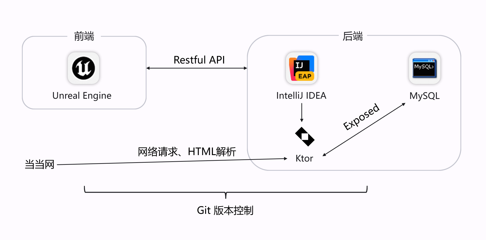

### 3.3 模块设计

在本系统客户端中，分为了Roguelike游戏和商城模块，往下细分了登录页面、开始菜单、游戏内容、结算页面、商品列表页面、订单列表页面。

进入游戏后会打开登录页面，用户登录后进入开始菜单。在开始菜单中，用户可以开始游戏、打开游戏商城或退出游戏，游戏结束后会进入结算页面，而商城中包含了商品列表和订单。

本系统的后端分为服务器和数据库，往下细分了用户、商品和订单接口和相应的数据库表。用户接口可以进行登录、查询游戏点数；商品接口可以获取商品列表或查找单个商品；订单接口可以创建订单或获取订单列表。

## 4. 游戏设计

本系统采用前后端分离架构，游戏主体与后端服务共同构建起完整的运行体系。本系统注重游戏框架的灵活性和可持续性，通过模块化设计实现功能组件的便捷替换，采用可扩展架构应对未来的版本迭代需求。这种设计策略不仅加快了开发进度，更确保了代码质量的可控性——开发团队能够快速响应需求变更，同时保持系统架构的清晰度。

### 4.1 游戏机制设计（经济系统/成长系统）

Roguelike是以随机生成和永久死亡为特点的游戏类型，起源于1980年的游戏《Rogue》，因其独特的机制和深度的策略性，逐渐发展为一个独立的类别。在本系统的游戏中，玩家需要在一个随机生成的世界中探索，击杀怪物以提升自身能力。玩家的最终目标是找到逃生裂隙，最终安全出逃，获得点数[33]。如果玩家在逃生途中不慎死亡，会直接结束游戏，结算本局游戏点数。游玩获得的点数将作为游戏商城中的货币，玩家可以在其中兑换真实商品。

游戏的画面风格参考了《歧路旅人》、《饥荒》等游戏，采用2D+3D的画面表现形式，游戏中的所有生物采用2D精灵图，而游戏场景则使用3D模型。在2D像素画风和3D模型的强烈对比下，可以给玩家带来一种不一样的游戏体验。游戏开发过程中用到的美术资源均来自虚幻引擎Fab的资源，以及开源社区的素材。

本系统的游戏中设计了一套相对简单且好理解的经济系统。玩家在游玩过程中击败其他生物可获得随机的游戏点数，游戏结束时会根据本局游戏结果对游戏点数做结算，游戏点数会直接计入玩家账户。

在游戏中，本文结合游戏美术风格搭建了真实商品商城。在这里，玩家可以使用玩游戏获得的游戏点数进行商品兑换，将游戏中的虚拟资产转化为显示世界中的真实资产。在货币的转化汇率上，本文参考了市面上的多款完成任务兑换现金的软件，决定以1000:1将游戏货币转化为法定货币。

在玩法上，本文构建了轻度的Roguelite游戏，并弱化了角色能力提升带来的多重选择和游戏策略性，转而更注重玩家的操作、场景的丰富性和游戏表现力。玩家在游玩过程中可以提升角色属性值，但这部分是隐形存在的。

### 4.2 随机化

#### 4.2.1 随机地图

游戏的基础地形是由400*400m的平面方格组成，地图的四周使用巨石围绕，玩家在游玩时只能看到旁边的巨石。

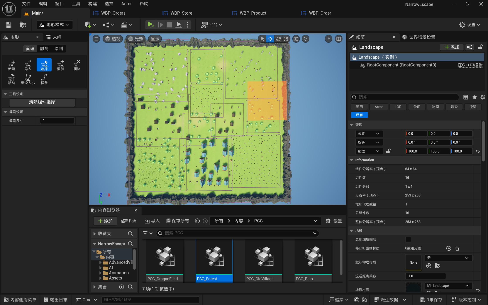

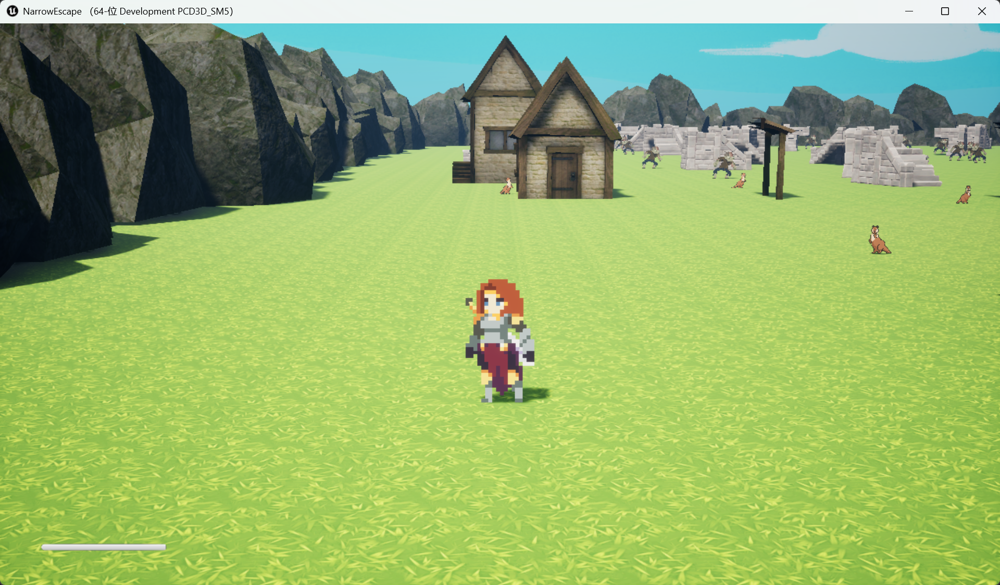

本系统游戏使用虚幻5的PCG技术程序化生成了场景中的建筑、植被和生物，通过提前预制生物与环境相匹配的PCG图，并在场景加载时对放置在关卡中的PCG图进行随机缩放，以改变该实例的随机种子，实现地图的随机效果。相比传统的纯手工制作场景，PCG场景能够提供更多的不确定性，同时减少时间成本。

PCG图的生成需要经历获取地形数据、使用表面采样器对地形数据进行采样、对采样后的数据进行一系列的调整、修改和差异化等步骤，最终在指定区域内生成静态网格体、Actor等元素。

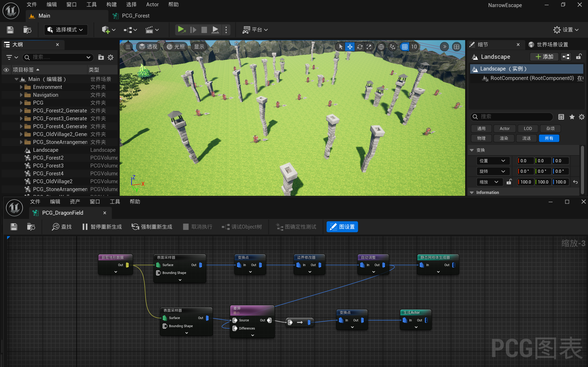

本游戏利用此框架设计了森林、城镇、废墟、石阵等不同风格的地貌，并在其中生成了与之相匹配的生物。在游戏开始时，程序会生成随机的种子给PCG，让场景中的物品拥有随机位置和转向。

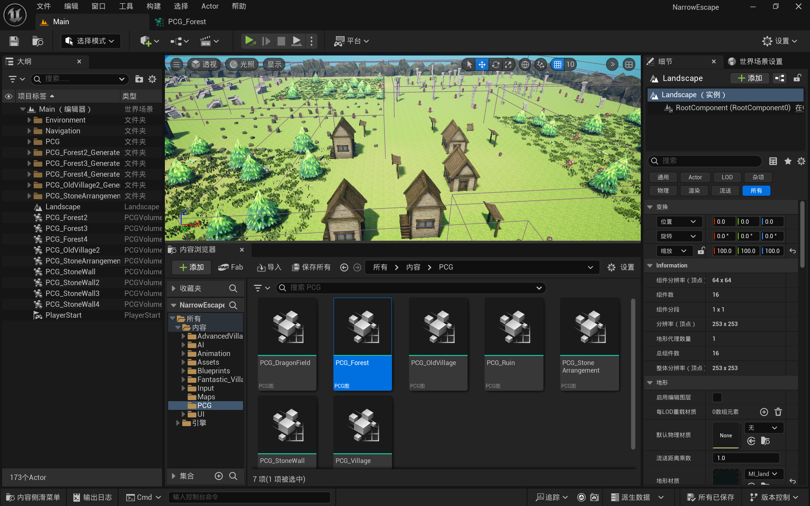

#### 4.2.2 随机奖励

本系统设计了生物击杀奖励。玩家在游戏中击杀敌人或动物可以获得一定的游戏点数奖励，奖励将在生物所拥有点数附近进行波动，以实现随机性。此外，玩家在击杀生物时，还能获得随机的生命值或攻击力提升。

### 4.3 用户体验设计（UX）

####  4.3.1 生物设计

为了方便后续开发维护，本游戏设计了一套易于扩展的游戏生物系统。在后续添加新的生物时，可以快速集成已有功能。这样既降低了开发成本，也减少了玩家因为对旧生物群落产生厌倦而放弃游玩的情况。

游戏中的生物都统一由一个蓝图类BP_Creature（生物，派生自PaperZDCharacter）派生而来，在BP_Creature下派生出BP_Animal（动物）和BP_Hunter（狩猎者，可对其他生物发起攻击），BP_Hunter下派生出BP_Character（玩家）和BP_Enemy（敌人）。在之后如果需要添加新的生物，只需要由BP_Animal、BP_Character和BP_Enemy派生即可。

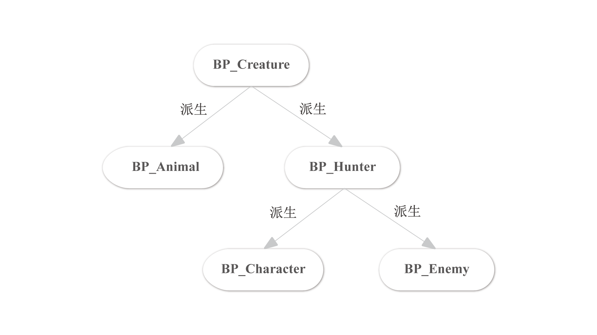

游戏中的生物都是2D精灵，在将2D纹理导入虚幻引擎后，需要使用Pager2D对纹理做处理，提取出精灵图并组成对应动画的纸片图像序列。之后使用PaperZD插件创建精灵的动画源和动画蓝图。

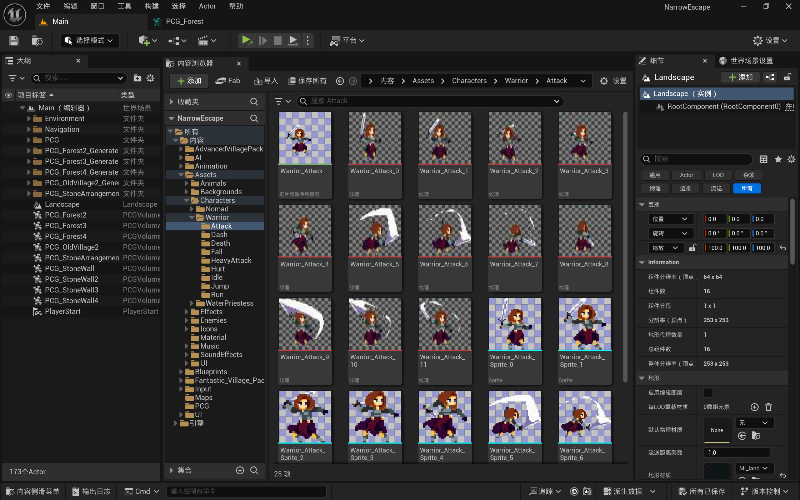

2D生物需要将精灵材质改为MaskedLitSpriteMaterial，并设置投射阴影以展现光照阴影效果。

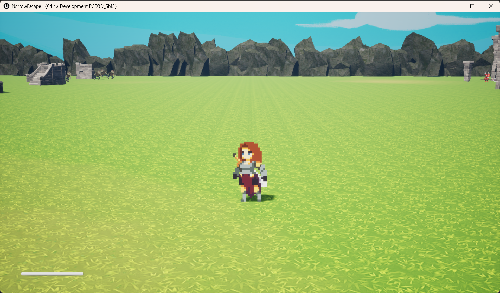

因为所有生物皆为2D精灵图，其Z轴旋转只能有两个值：0或180。生物移动时，需要根据X轴方向决定生物的Z轴相对旋转。具体来说，当X轴方向为正时，Z轴应相对旋转应为0，当X轴方向为负时，Z轴应相对旋转应为180。

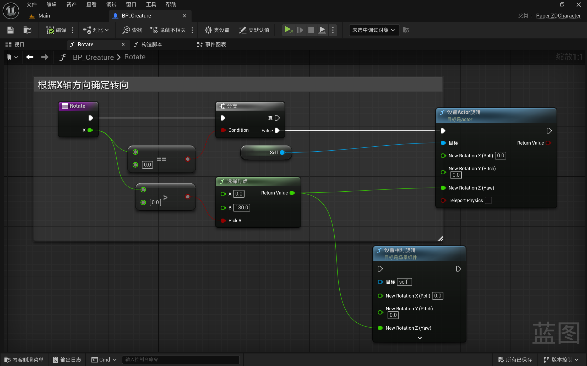

#### 4.3.2 角色动画

在虚幻5中，2D角色的动画需要通过一系列的动作纹理图组合成纸片图像序列来实现，而多个动画的切换需要借助动画状态机来实现。虚幻5本身并没有对2D角色动画状态机的支持，因此需要使用PaperZD插件创建2D角色的动画源和动画蓝图。

在本游戏中，角色的动画源中定义了轻攻（Attack）、冲刺（Dash）、死亡（Death）、下落（Fall）、重击（HeavyAttack）、受伤（Hurt）、待机（Idle）、跳跃（Jump）和跑步（Run）动画，其他类型生物的动画源数量会相对较少。

动画蓝图中可以创建动画状态机，根据角色当前状态来播放动画。

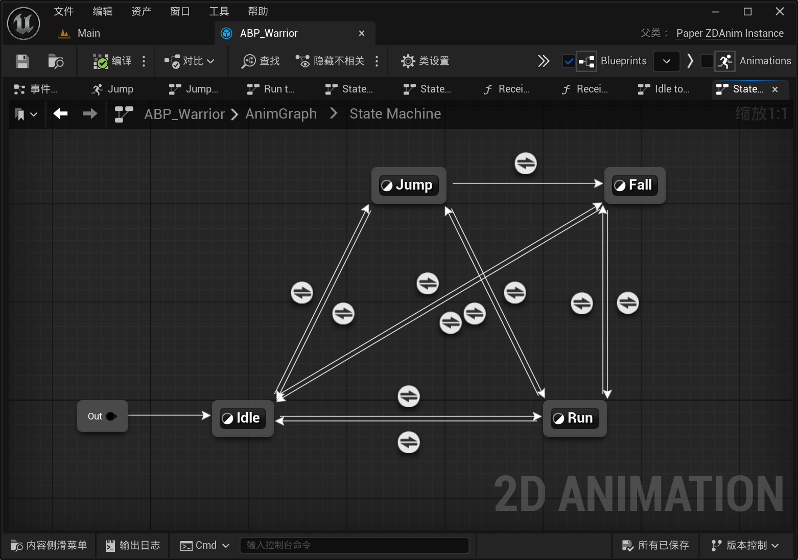

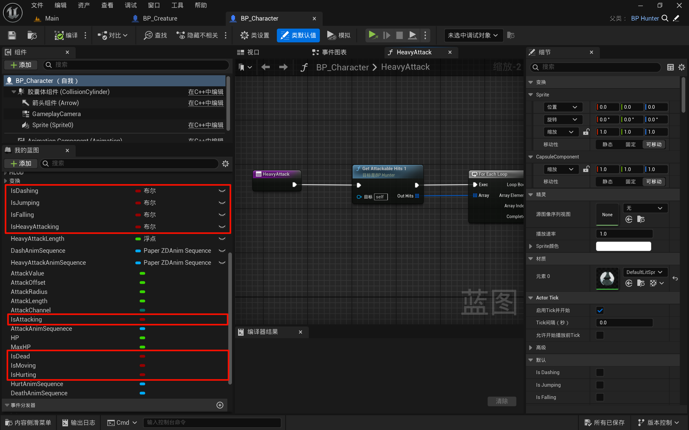

#### 4.3.3 输入操作

本系统使用了虚幻5推出的全新增强输入系统用于实现玩家输入操作。为了丰富玩家的操作体验，本系统为玩家设计了四个操作指令，分别是移动、跳跃、冲刺和攻击。

在实际开发时，玩家移动的输入操作使用IA_Move定义，将键盘上的WASD键映射到对应轴向。玩家在控制角色移动时，角色会根据玩家按下的键进行位置移动和自身旋转。值得注意的是，本系统的角色为2D精灵图，其旋转角度值只能是0或180，而移动则可以向平面的任意方向。

角色的跳跃操作使用IA_Jump定义，将该操作绑定到空格键。本系统借助了虚幻5提供的角色跳跃方法，并结合布尔值限制角色只能在处于地面上才能跳跃，完成了角色的跳跃操作。

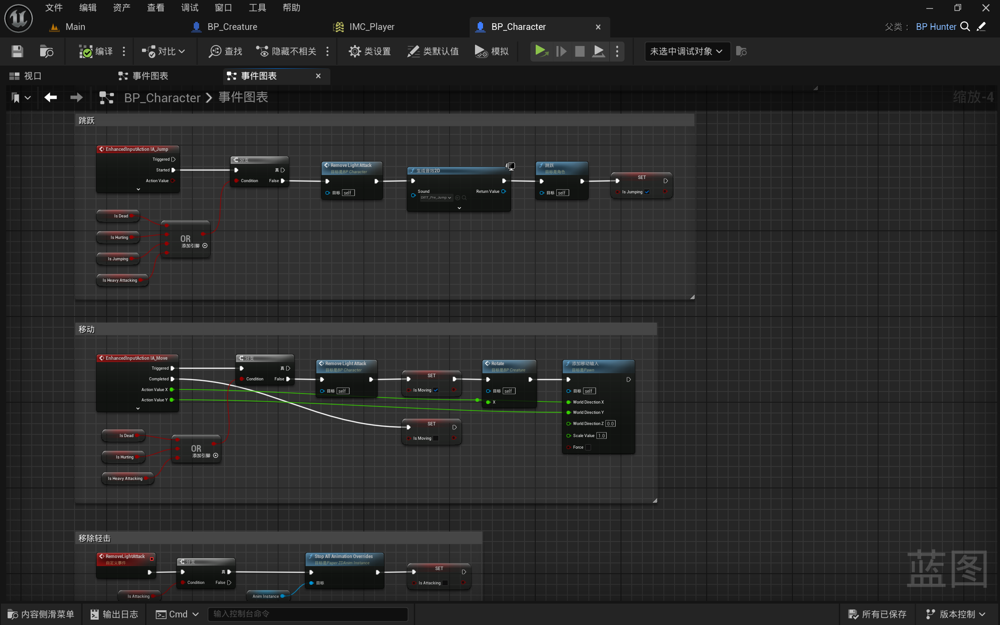

角色冲刺则使用IA_Dash绑定到Shift键，本系统借助虚幻5提供的弹射角色方法，在角色具备速度时会向当前速度的X和Y轴分量构成的向量方向弹射角色，该方向会稍微向上偏移以确保角色不会因与地面产生摩擦而无法弹射。

角色的攻击动作更为复杂，它通过IA_Attack绑定到鼠标左键。当角色没有离开地面时，攻击输入会确定为轻攻击，角色向前方发出多球体碰撞检测，并对被检测到的动物或敌人造成伤害。若角色离开地面，则此次攻击会被判定为重击，角色向前方发出碰撞检测，对检测到的动物或敌人造成伤害并击退它们，伤害值比轻攻击有更高的倍率。

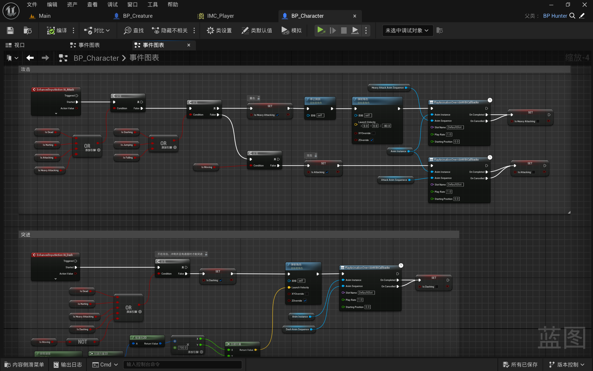

除此之外，实际的玩家操作操作其实比这些更复杂，往往会涉及到多个操作间的优先级处理。例如，角色不能同时进行攻击和移动操作，在实际开发中，本系统设定角色在进行轻攻击时可以被移动操作打断，而重攻击时则无法做到这一点。

在开发过程中，需要先创建对应的输入操作，在输入映射上下文中将输入操作与按键一一对应。

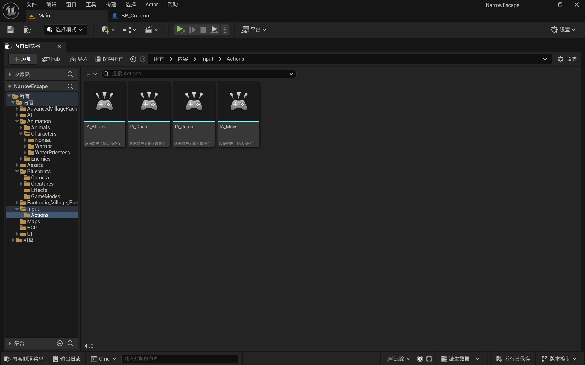

之后需要将映射上下文添加到玩家控制器增强输入本地玩家子系统上，并实现相应的输入操作事件，即可实现玩家输入操作。

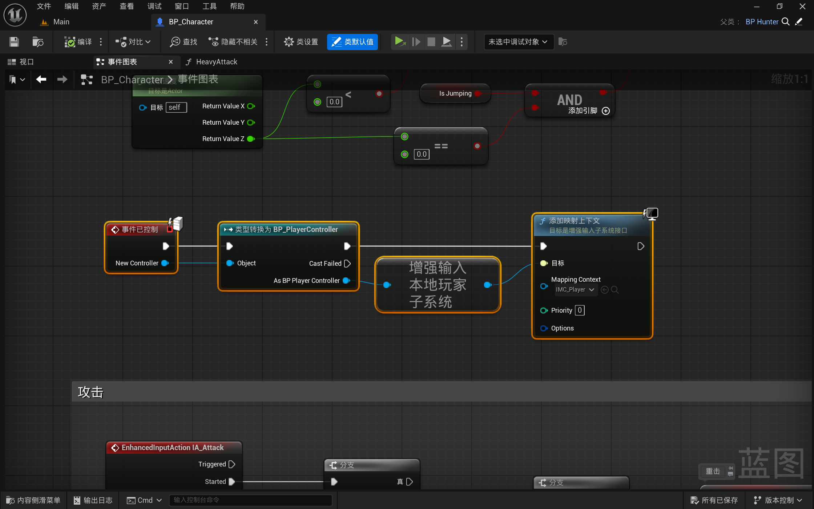

#### 4.3.4 动物和敌人AI

本系统综合考量动物和敌人的行为特性，结合虚幻5引擎的人工智能行为树（AI Behavior Tree）和PawnSensing组件，设计了两套符合需求的AI控制行为。

PawnSensing作为动物和敌人的“视觉”，本系统设计了当它们看不到玩家时，会取自身初始位置一定圆形半径内的随机点进行移动，模拟它们在无玩家干扰下的行为。

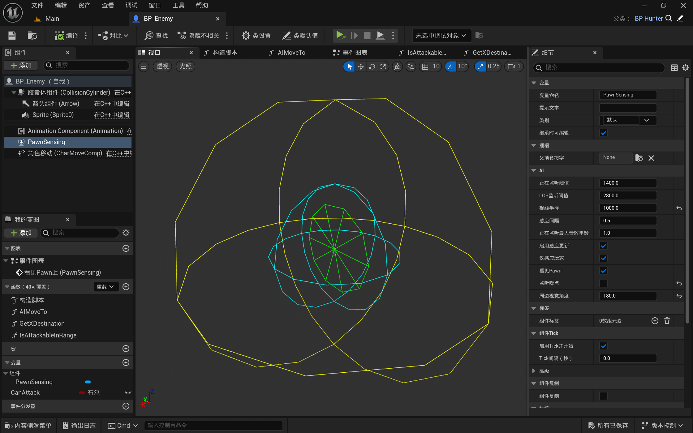

作为动物，它们在见到角色时会向远离角色的方向移动，以免受到玩家攻击。这是通过PawnSensing组件设定动物可见范围，在见到玩家时触发相应事件，此事件会获取玩家位置，获取自身到玩家的方向向量并取反，综合得出需要移动的方向，并由AI控制器驱动其移动。

而作为敌人，它们在见到角色时会主动靠近，并尝试向玩家发起攻击。除了此前用到的PawnSensing组件外，敌人还需要在靠近玩家时对正前方进行多球体碰撞检测，若检测到玩家则会播放攻击动画发起攻击，在攻击动画进行时会有关键帧做出碰撞检测，检测到玩家则对其造成伤害。值得提出的是，敌人的攻击间隔使用AI行为树做了一定限制，使得玩家有时间采取应对手段。

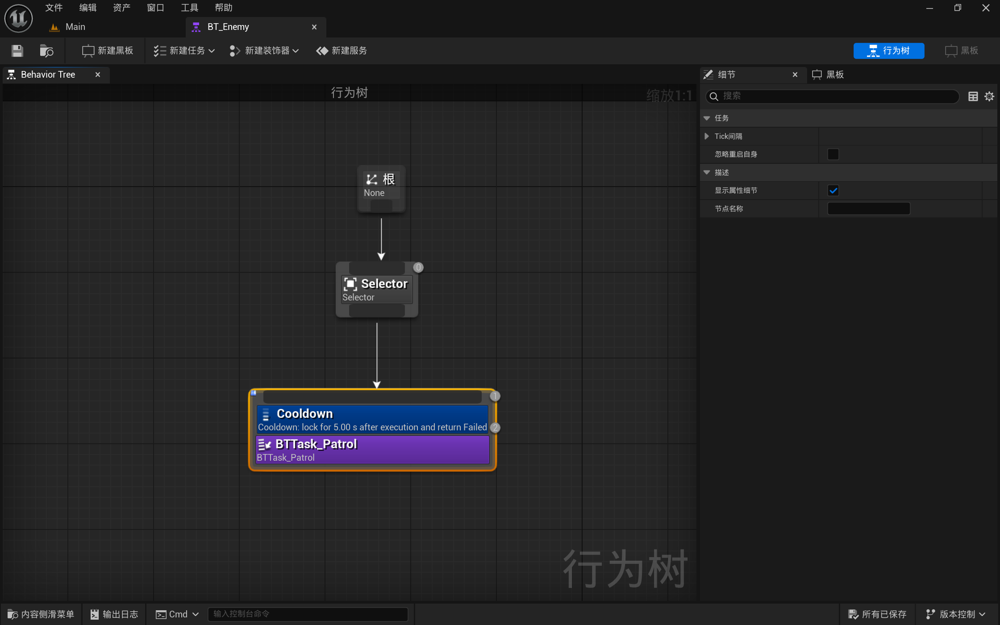

#### 4.3.5 攻击伤害实现

虚幻5的蓝图中提供了应用伤害和任意伤害事件。在播放攻击动画时，可以向角色前方执行按通道进行多球体碰撞，检测到可攻击对象时，调用应用伤害对可攻击对象造成伤害。对于被攻击方，则实现任意伤害事件，减少生命值并播放受伤动画。

在本文中，应用伤害的功能被定义于BP_Hunter中，只有狩猎者才能发出攻击；而任意伤害事件被定义于BP_Creature中，所有生物均可被攻击。

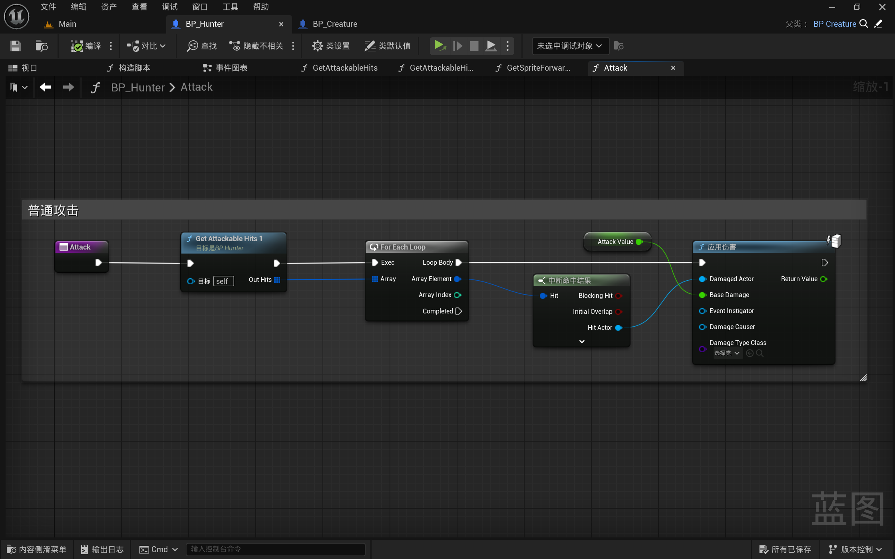

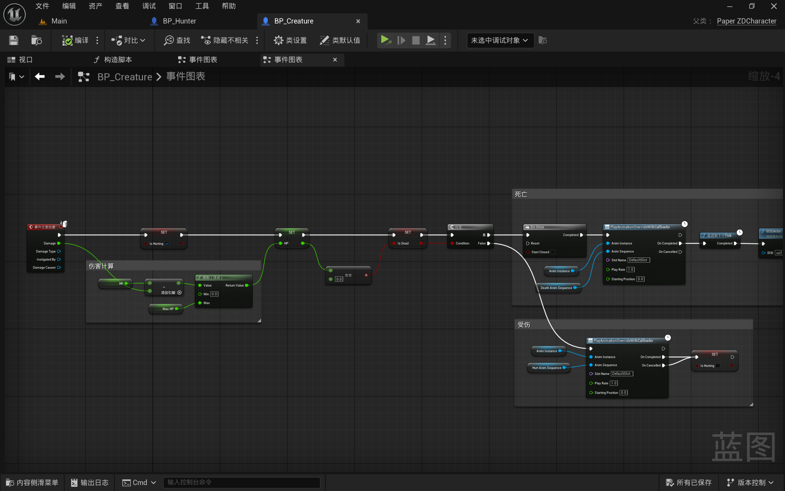

#### 4.3.6 音效与视觉表现

虚幻5支持在多种情景下播放音乐或音效，例如在UI创建时，可以调用PlaySound2D来播放背景音乐；鼠标悬停按钮时，可以触发相关事件并播放音效；角色播放动画时，可以定义播放音效的通知实现在动画时播放音效。通过为多种情景添加适当的音乐或音效，可以提升用户的使用体验[6]。

本文参考了《歧路旅人》的游戏表现风格，采用2D+3D的形式呈现角色和游戏场景，同时使用多个2D特效补充角色动画过程中的单调表现，提升游玩乐趣。

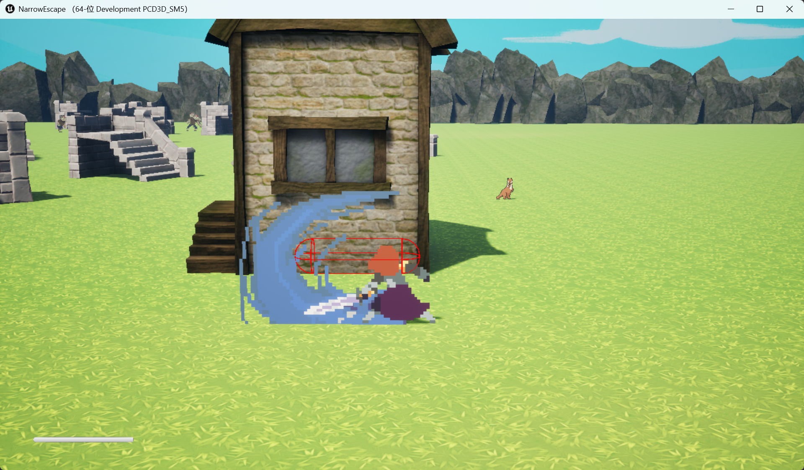

### 4.4 界面交互（UI）

虚幻5提供了强大的工具和框架来创建用户界面（User Interface，简称UI）。UMG是虚幻5中用于创建用户界面的主要工具，基于Slate框架构建，提供了可视化的UI设计器。其主要组件包括Widget Blueprint和Widget Components，可以用来组合复杂的用户界面。

在设计UI时，应当将其拆分为多个小部件（Widget），便于复用和维护。例如，多个按钮可以来自同一个组件蓝图类，减少重复操作的同时能做到最大化复用逻辑。要尽量避免在每帧中更新不必要的UI元素，使用缓存和延迟更新技术。确保UI交互逻辑直观易用，提供清晰的提示和反馈。

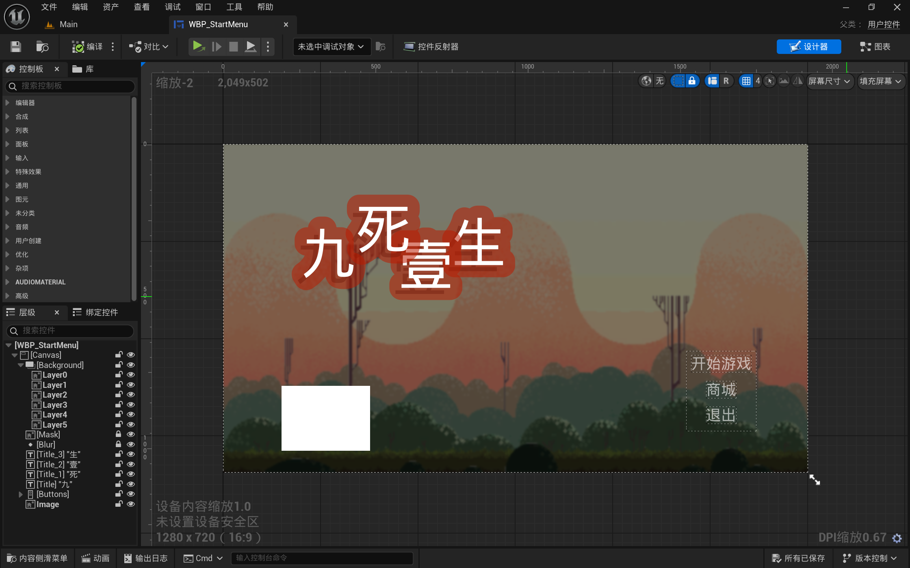

与传统游戏虚拟化道具商城不同，本系统中的游戏商城可以兑换的商品均为真实商品，玩家在控制游戏角色获得游戏点数后，可以直接使用游戏点数来购买真实商品。这样的设计可以强化虚拟与现实的联系，玩家在操控游戏角色进行一系列任务后，可以获得来自现实世界的正面反馈，从而提高玩家的游玩意愿。

在积攒到一定游戏点数后，玩家可以前往游戏商城中购买商品，商品的类型主要是一些日用品、食品和游戏周边，玩家可以根据个人喜好兑换商品。游戏商城的风格与游戏的整体风格一致，不会给玩家太大的割裂感[8]。

与电商平台的商城列表有所不同，本系统的游戏列表适配了横屏布局，可以在一行中展示多个商品，并且商品数量可以随屏幕的宽度进行动态调整。商城的货币展示采用了图标和数字的组合，货币图标与游戏结算时获取的游戏点数图标一样采用像素画风，使得游戏商城与游戏内容具有高度一致性，具有较高的辨识度。

商品的图片外层加了像素化的边框，与货币的效果类似，通过这些具备游戏风味的元素，可以呈现出与游戏画风一致的视觉效果。商城的背景使用了像素画和黑色透明蒙版，增加页面丰富度的同时不会带来视觉干扰。

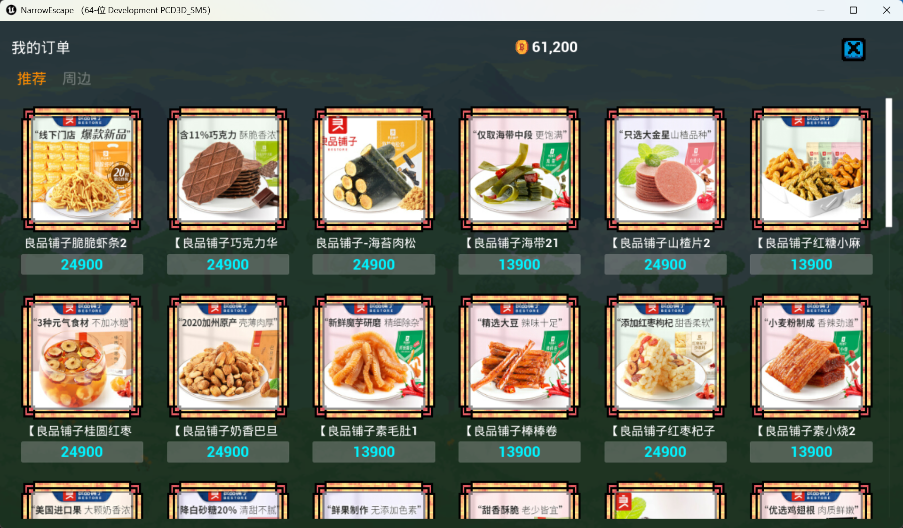

玩家在兑换商品后，可以通过“我的订单”按钮打开订单页面，查看已兑换的商品。订单页面的UI与商品列表风格保持一致，这样不会给玩家带来太大的割裂感。

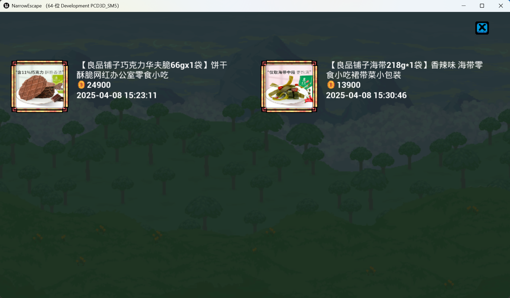

## 5. 后端设计

### 5.1 数据库设计

本系统使用MySQL作为后端数据库，主要用于存储用户、商品和订单数据。

#### 5.1.1 实体与关系

本系统的数据库主要包含了三个实体：用户、商品和订单。三者之间存在以下关系：

（1）用户与商品：一个用户可以购买多个商品，一个商品可以属于多个用户。

（2）用户与订单：一个用户可以拥有多个订单，一个订单属于一个用户。

（3）商品与订单：一个商品可以属于多个订单，一个订单包含一个商品。

#### 5.1.2 字段设计

（1）用户

| 字段       | 类型      | 说明      |
|----------|---------|---------|
| id（主键）   | integer | 用户唯一标识  |
| name     | varchar | 用户名     |
| password | text    | 用户密码哈希值 |
| points   | integer | 拥有的游戏点数 |

（2）商品

| 字段     | 类型      | 说明       |
|--------|---------|----------|
| id（主键） | long    | 商品唯一标识   |
| name   | varchar | 商品名称     |
| image  | varchar | 商品图片     |
| points | integer | 兑换所需游戏点数 |

（3）订单

| 字段          | 类型      | 说明     |
|-------------|---------|--------|
| id（主键，自动递增） | integer | 订单唯一标识 |
| userId      | integer | 用户唯一标识 |
| productId   | long    | 商品唯一标识 |
| time        | varchar | 订单创建时间 |

### 5.2 接口设计

（1）用户

| 路由      | 方法   | 参数 | 表单            | 说明      |
|---------|------|----|---------------|---------|
| /login  | POST | -  | -             | 用户注册、登录 |
| /points | GET  | -  | -             | 用户拥有点数  |
| /points | POST | -  | points: 增加的点数 | 用户点数新增  |

（2）商品

| 路由             | 方法  | 参数 | 表单 | 说明   |
|----------------|-----|----|----|------|
| /products      | GET | -  | -  | 商品列表 |
| /products/{id} | GET | -  | -  | 某一商品 |

（3）订单

| 路由      | 方法   | 参数 | 表单                  | 说明   |
|---------|------|----|---------------------|------|
| /orders | GET  | -  | -                   | 订单列表 |
| /orders | POST | -  | productId: 购买商品唯一标识 | 订单创建 |

### 5.3 数据安全

因本系统中有商品交易功能，保障数据安全尤为重要，本系统使用了Argon2哈希算法和JWT（JSON Web Token）分别对用户密码和接口访问做安全化处理。

一般地，用户的密码在存储到数据库表时不能以明文形式存储，而必须使用不可逆的哈希算法进行处理，将处理后数据存储到数据库表。当用户发起登录请求时，将收到的密码哈希处理并与数据库中的密码比对确定是否一致。Argon2是一种专为密码哈希和密钥派生而设计的哈希算法，它在2015年赢得了密码哈希竞赛（Password Hashing Competition），并被广泛认为是目前最安全的密码哈希算法之一。

本系统中借助了Argon2的实现库对用户密码进行哈希处理，在用户登录时，若用户未注册，则会将用户密码进行哈希处理，并将用户信息存储到数据库用户表；若用户已注册，则会将收到密码的哈希结果与数据库存储的密码比较，若相同则登录成功。

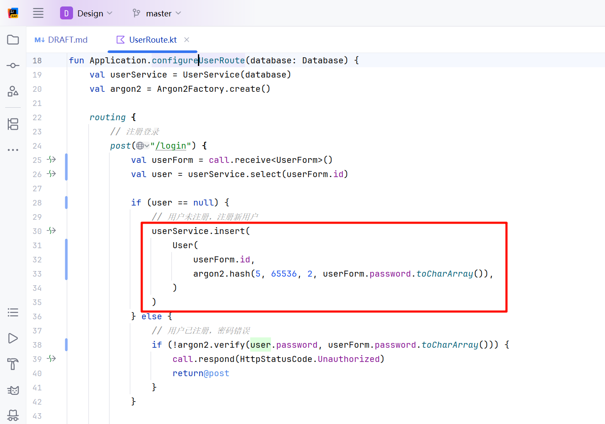

此外，为了方便用户登录验证和服务器资源访问限制，本系统还引入了JWT做鉴权校验。JWT是符合RFC 7519标准的分布式认证解决方案，它通过封装结构化数据实现了跨域安全传输。JWT的数据结构由头部（Header）、载荷（Payload）和签名（Signature）三部分构成，头部采用元数据封装策略，包含了令牌的类型声明和加密算法标识；载荷采用声明式数据模型，存储了用户身份标识、权限信息等关键数据元；签名通过非对称加密机制对Base64Url编码的头部和载荷实施完整性校验。

本系统基于Ktor框架的JWT认证模块，采用插件化架构进行功能集成，通过定义自定义声明验证逻辑和令牌生命周期管理策略，构建了具有可扩展性的认证中间件，有效解决了微服务架构下的跨系统鉴权难题。本系统后端的商品列表、订单等资源访问均需要在请求头中添加Authorization字段，值为Bearer <Token>。

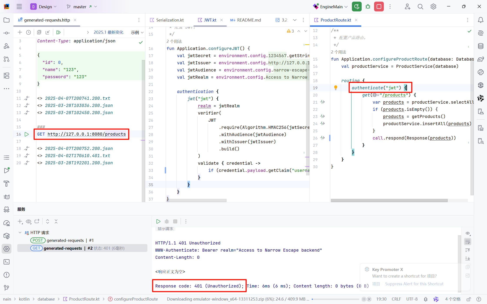

### 5.4 商品爬虫

因展示需要，本系统的商品数据来自当当网，该爬取功能使用懒加载设计以减小对当当网服务器的压力，只有当商品列表接口被调用时，才可能会发送请求。当系统后端商品列表接口被请求时，程序会判断当前数据库商品表中是否有数据，若列表为空，则使用Ktor客户端向当当网发送网络请求获取商品页HTML，结合HTML解析库Ksoup（基于Jsoup）将超文本解析为程序可用的数据类型，同时进行人民币和游戏货币的单位转换，最后将数据返回前端，并将商品列表存储于数据库供下次使用。

若列表不为空，则不会进行网络请求，直接将数据库表的数据返回前端。

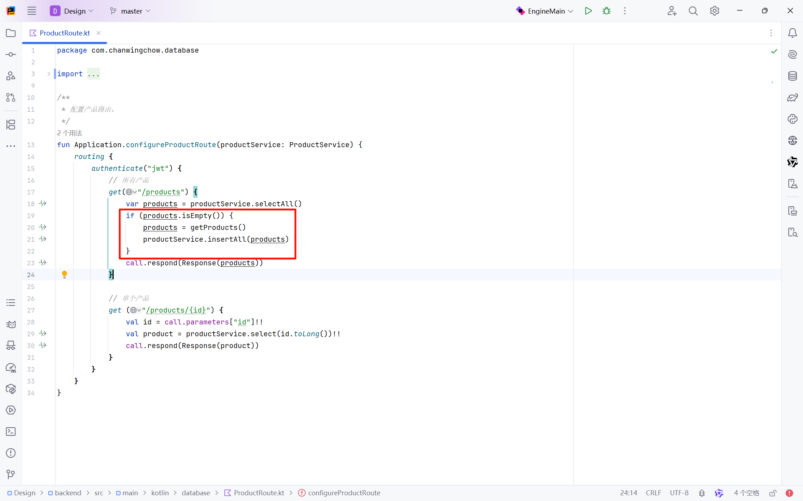

### 5.5 推荐算法

本系统设计了基于玩家历史购买记录[12]、当前游戏点数数量[11]和随机结合的推荐算法。当商品列表接口被调用时，程序会获取玩家的历史购买记录，若历史购买记录为空，则根据是否有超过三分之二的商品所需点数大于玩家点数，进行按点数升序或打乱返回；否则，使用模糊搜索将历史购买中的商品与所有商品的商品名进行匹配，匹配成功则将商品加入到推荐列表，最后对推荐商品和剩余商品判断是否有三分之二超过玩家数量进行按点数升序或打乱，拼接返回。

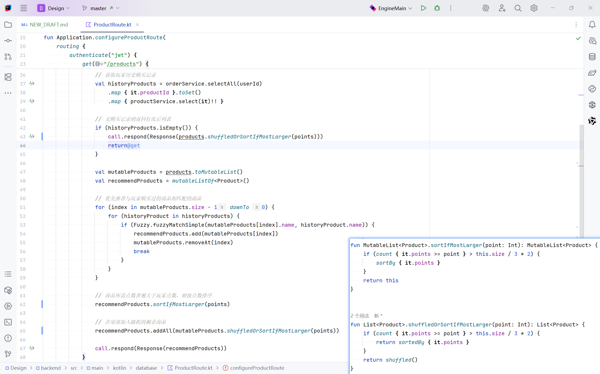

## 6. 总结与展望

### 6.1 研究成果总结

本文使用虚幻5和Ktor分别开发了游戏前后端，对Roguelike游戏电商化做出了简单实现，提供了具有良好扩展性和可维护性的系统设计。在本系统中设计了游戏点数作为购买游戏中真实商品的游戏货币，而在真实化商城的设计上，参考了游戏的整体画风和视觉表现，构建了符合游戏风格的真实商品商城。本文主要的工作和贡献如下：

第一，对当前游戏电商化进行了总结分析，并指出Roguelike游戏在游戏电商化中的应用前景。Roguelike游戏随机化的特点为其应用于营销领域带来了巨大优势，也为后续进一步考虑在随机化的基础上加入随机获得的优惠券等营销手段带来了可能性。

第二，本文在服务器安全性方面使用了Argon2和JWT技术，实现了用户密码加密和资源访问限制。

第三，本文采用的商品推荐算法是基于玩家历史购买记录进行过滤，根据玩家点数和商品的所需点数进行排序，最后结合一些随机的内容进行混合。

第四，本文使用虚幻5开发了2D+3D的Roguelike游戏，使用程序化内容生成（PCG）框架自动生成多样化的游戏场景和生物。同时，采用Ktor、Exposed和Kotlin Serialization等技术构建了高效、可扩展的游戏商城服务器。在保持游戏与商城高度统一的同时，也确保系统的可利用、可维护。

### 6.2 不足与改进方向

第一，本文只实现了使用游戏货币全量购买商品，没有实现部分商品采用游戏货币部分抵扣加真实货币购买的功能。这会导致游戏对于商家而言只有支出而没有收入，需要做进一步优化。同时，还可以考虑通过引入广告的方式增加收入。

第二，游戏的可玩性和丰富度尚存在不足。游戏存在生物群落比较单一、游戏道具不够丰富等问题。游戏的战斗系统存在缺陷，玩家攻击时并不能主动走向被攻击生物，角色的攻击方式也过于单一。游戏的商城功能并不完善，例如购物车功能、订单系统的缺失。这些需要后续逐步优化和迭代。

## 参考文献

[1] 刘亚奇.孵化平台Roguelike游戏项目设计与应用探究[J].电脑编程技巧与维护,2022,(11):153-156.

[2] 张国梅.基于Unity引擎的Roguelike游戏的设计与开发[J].电脑编程技巧与维护,2022,(02):156-158.

[3] 高蕾.电商平台游戏化对用户冲动购买行为的影响机制研究[D].东华大学,2024.

[4] 熊瑛.电商平台游戏化营销对消费者持续购买意愿的影响研究——基于使用和满足理论的视角[J].商业经济研究,2024,(20):71-74.

[5] 陈元硕,谢薇.电商平台游戏中的绿色广告行为及其规制研究[J].科技传播,2024,16(11):120-123.

[6] 张林.移动电商平台游戏化对消费者行为的影响机理研究[D].哈尔滨工业大学,2024.

[7] 何玉川.游戏化激励对电商平台顾客忠诚度影响研究[D].山西财经大学,2024.

[8] 李雨欣.游戏化互动对电商平台用户参与意愿的影响研究[D].广东财经大学,2024.

[9] 汪旭晖,刘熙桐,宋松.平台型电商游戏化营销策略对用户消费行为的影响[J].中国流通经济,2023,37(04):47-59.

[10] 李彤云,马军平,杨昊博,曹丽.产品信息的游戏化传播及说服效应研究[J].内江科技,2022,43(01):82-83+148.

[11] 李建斌,钱自顺,蔡学媛,戴宾.跨境电商下基于商品属性–情境的推荐算法[J].系统工程学报,2024,39(03):333-343+468.

[12] 王茜,喻继军.基于商品购买关系网络的多样性推荐[J].系统管理学报,2020,29(01):61-72.

[13] 楚啸原,杨晓凡,理原,雷雳.虚拟商品感知有用性与网络游戏消费意愿：有调节的中介模型[J].中国临床心理学杂志,2020,28(05):1013-1016.

[14] 李宣.移动营销中的游戏化及其规制研究——基于行为经济学的视角[J].四川师范大学学报(社会科学版),2023,50(06):98-107.

[15] 王治,江文婷.游戏化营销策略对消费者补偿性消费行为的影响[J].商业经济研究,2024,(14):47-51.

[16] 余文涛,张国阳,何毅,耿慧.平台经济环境下“平台-物流-商家”生态合作演化博弈研究[J].系统工程理论与实践,1-30.

[17] 焦媛媛,高雪,张丹.电商平台情境下顾客黏性构念开发及其形成机制研究[J].管理工程学报,2023,37(04):67-84.

[18] 杜松华,徐嘉泓,张德鹏,杨晓光.游戏化如何驱动电商用户绿色消费行为——基于蚂蚁森林的网络民族志研究[J].南开管理评论,2022,25(02):191-204.

[19] 张剑,罗君.“游戏化”视角下电商平台“拉人助力”玩法分析——以“超级星秀猫”为例[J].文化与传播,2021,10(04):87-91.

[20] 马可盈.游戏化营销情境中电商平台用户持续使用意愿影响因素研究[D].华南理工大学,2022.

[21] 文露.手机电商时代APP游戏化特征对消费者持续使用意愿的影响研究[J].中国储运,2022,(02):86-87.

[22] 唐乐水,马缘园.心流理论下电商直播间的游戏化叙事[J].南京晓庄学院学报,2022,38(03):104-109.

[23] Paschmann JW, Bruno HA, van Heerde HJ, Völckner F, Klein K. Driving Mobile App User Engagement Through Gamification[J]. Journal of Marketing Research (JMR). 2025, 62(2):249-273.

[24] Denden M, Abed M, Holotescu V, Tlili A, Holotescu C, Grosseck G. Down to the Rabbit Hole: How Gamification is Integrated in Blockchain Systems? A Systematic Literature Review[J]. International Journal of Human-Computer Interaction. 2024, 40(19): 5617-5631.

[25] Butler N, Spoelstra S. Redemption Through Play? Exploring the Ethics of Workplace Gamification[J]. Journal of Business Ethics. 2024, 193(2): 259-270.

[26] Ebrahimi E, Irani HR, Abbasi M, Abedini A. The effect of gamification on brand equity and desirable consumer behaviors in online retail stores: The mediating role of brand engagement[J]. Interdisciplinary Journal of Management Studies. 2024, 17(2): 379-391.

[27] Durmaz TB, Fuertes JL, Imbert R. Toward Usability Testing of Motivational Affordances through Gamification[J]. International Journal of Human-Computer Interaction. 2024, 40(9): 2398-2414.

[28] Milanesi M, Guercini S, Runfola A. Let's play! Gamification as a marketing tool to deliver a digital luxury experience[J]. Electronic Commerce Research, 2023, 23(4): 2135-2152.

[29] Kusumawardani KA, Widyanto HA, Tambunan JEG. The role of gamification, social, hedonic and utilitarian values on e-commerce adoption[J]. Spanish Journal of Marketing - ESIC, 2023, 27(2): 158-177.

[30] Zhang J, Jiang Q, Zhang W, Kang L, Lowry PB, Zhang X. Explaining the Outcomes of Social Gamification: A Longitudinal Field Experiment. Journal of Management Information Systems[J]. 2023, 40(2): 401-439.

[31] Xu X-Y, Tayyab SMU, Jia Q-D, Wu K. Exploring the Gamification Affordances in Online Shopping with the Heterogeneity Examination through REBUS-PLS[J]. Journal of Theoretical & Applied Electronic Commerce Research. 2023, 18(1): 289-310.

[32] Szachta K. Gamification in marketing strategies on the example of the e-commerce market[J]. Zeszyty Naukowe PTE w Zielonej Górze, 2022, ½(16): 149-159.

[33] Ho Y-J, Liu S, Wang L. Fun Shopping: A Randomized Field Experiment on Gamification[J]. Information Systems Research. 2023, 34(2): 766-785.

## 致谢

流年似水，岁月如歌。一路上磕磕绊绊，笑语欢声，随文章落幕，我的学生生涯也终将告一段落。

感谢好友的督促和鼓励，陪我走完大学最后的时光；感谢导师的宝贵建议，让我能不断明确行文方向；感谢家人长久以来的支持，让我能够完成自己的梦想；也感谢你，亲爱的读者。
